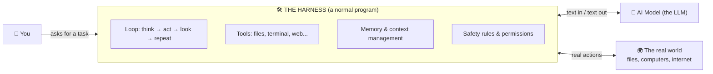
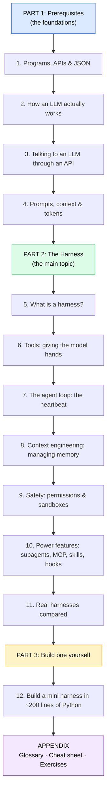

# Harness Learning: AI Harnesses Explained From Zero

This guide teaches you what an **AI harness** is, how one works inside, and how to build one yourself. It starts from the basics and uses plain English, analogies, and lots of diagrams. You don't need to know anything about AI to begin.

> **The one-sentence version:**
> An AI model on its own can only *read text and write text*. A **harness** is the program wrapped around the model that lets it *do things*: read files, run commands, search the web, remember what happened, and keep working step by step until a job is done.

---

## 🗺️ Your learning path

Follow the parts in order. Each one builds on the one before.

## 📚 Table of contents

### Part 1: Prerequisites
| # | Chapter | What you'll learn |
|---|---------|-------------------|
| 1 | [Programs, APIs & JSON](part-1-prerequisites/01-programs-apis-json.md) | What a program is, what an API is, what JSON looks like |
| 2 | [How an LLM works](part-1-prerequisites/02-how-llms-work.md) | Tokens, next-word prediction, and why the model "forgets" |
| 3 | [Calling an LLM API](part-1-prerequisites/03-calling-an-llm-api.md) | Messages, roles, system prompts, and your first API call |
| 4 | [Prompts, context & tokens](part-1-prerequisites/04-prompts-context-tokens.md) | The context window, cost, and writing good instructions |

### Part 2: The Harness
| # | Chapter | What you'll learn |
|---|---------|-------------------|
| 5 | [What is a harness?](part-2-harness/05-what-is-a-harness.md) | The big picture, and why "model + harness = agent" |
| 6 | [Tools](part-2-harness/06-tools.md) | How a model that only writes text can still "use" a tool |
| 7 | [The agent loop](part-2-harness/07-the-agent-loop.md) | The think → act → observe cycle that drives everything |
| 8 | [Context engineering](part-2-harness/08-context-engineering.md) | Fitting a big job into a limited memory |
| 9 | [Safety, permissions & sandboxes](part-2-harness/09-safety-permissions-sandboxes.md) | Keeping an AI that can run commands from causing damage |
| 10 | [Power features](part-2-harness/10-power-features.md) | Subagents, MCP, skills, hooks, planning, memory files |
| 11 | [Real harnesses compared](part-2-harness/11-real-harnesses.md) | Claude Code, Codex, Cursor and others, plus the other meanings of "harness" |

### Part 3: Build one
| # | Chapter | What you'll learn |
|---|---------|-------------------|
| 12 | [Build your own mini harness](part-3-build/12-build-your-own.md) | A working coding agent, explained line by line ([code](part-3-build/code/mini_agent.py)) |

### Appendix
- [Glossary](appendix/glossary.md): every term in plain English
- [Cheat sheet](appendix/cheat-sheet.md): the whole guide on one page
- [Exercises & next steps](appendix/exercises-and-next-steps.md): practice projects from easy to hard

---

## 💡 How to read this guide

- **Diagrams**: the flowcharts are written in [Mermaid](https://mermaid.js.org/). GitHub draws them as pictures automatically. In VS Code, install a "Markdown Preview Mermaid" extension to see them.
- **Code**: the examples are in Python because it reads almost like English. You don't need to run anything until Part 3.
- **"🔑 Key idea" boxes** mark the sentences to remember.
- **"🧪 Try it" boxes** are small exercises you can do.
- If a word is confusing, check the [Glossary](appendix/glossary.md).

Start here → [Chapter 1: Programs, APIs & JSON](part-1-prerequisites/01-programs-apis-json.md)
