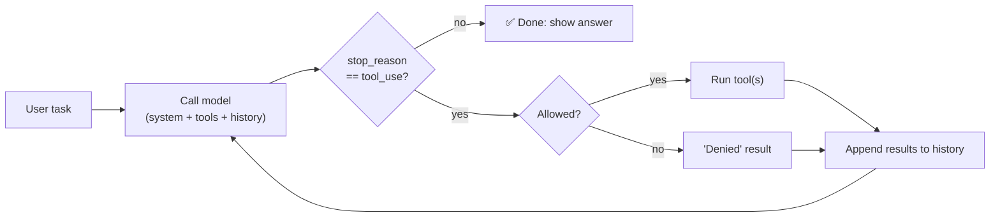

# Cheat Sheet: AI Harnesses on One Page

[← Contents](../README.md)

## The three facts everything is built on

1. 🗣️ **The model only writes text.** → The harness gives it **tools**.
2. 🧽 **The model forgets everything between calls.** → The harness keeps and **re-sends history**.
3. 📋 **The model only knows what's in its context.** → The harness **engineers the context**.

## The equation

> **Agent = Model + Harness**

## The loop (memorise this)



## The loop in code

```python
while True:
    r = client.messages.create(model=M, system=S, tools=T, messages=msgs, max_tokens=16000)
    msgs.append({"role": "assistant", "content": r.content})
    if r.stop_reason != "tool_use":
        break
    msgs.append({"role": "user", "content": [
        {"type": "tool_result", "tool_use_id": b.id, "content": run(b.name, b.input)}
        for b in r.content if b.type == "tool_use"
    ]})
```

## The harness's jobs

| Job | Key pieces |
|-----|-----------|
| 🔁 **Loop** | call → check `stop_reason` → run tools → repeat; step limits, timeouts |
| 🔧 **Tools** | name + description + input schema; errors go back with `is_error` |
| 📋 **Context** | system prompt, AGENTS.md/CLAUDE.md, just-in-time loading, compaction, caching |
| 🛡️ **Safety** | allow/ask/deny rules, permission modes, sandbox, hooks, git for undo |
| 💬 **Interface** | terminal / IDE / web / SDK; show progress; allow interrupts |
| ⚡ **Extras** | subagents, MCP, skills, hooks, slash commands, plan mode |

## Golden rules

- ✅ Tool descriptions are prompts: say **what** *and* **when**.
- ✅ Send **all** tool results back in **one** message, each matched by `tool_use_id`.
- ✅ Tool failures become **messages**, never crashes.
- ✅ Keep tool output **short**; cut it and say you did.
- ✅ History is **append-only**; keep the system prompt and tools **frozen** (for caching).
- ✅ Load context **just in time**; relevant beats more.
- ✅ Use **prompts** for judgement and **hooks** for rules that must never be skipped.
- ✅ Start in **ask** mode; use **full auto** only in a **sandbox**.
- ✅ Tell the agent **how to check its work** (tests, run the code).

## "Harness" can mean

| Term | Meaning |
|------|---------|
| **Agent harness** | Runs a model as an agent (this guide) |
| **Eval harness** | Runs a model/agent on a benchmark and scores it |
| **Test harness** | Runs software tests automatically |

[← Contents](../README.md)
