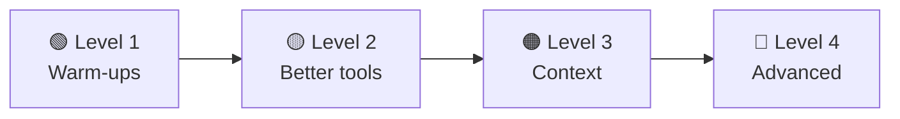

# Exercises & Next Steps

[← Chapter 12](../part-3-build/12-build-your-own.md) · [Contents](../README.md)

The best way to really understand harnesses is to **extend one**. Each exercise below adds a real feature to [`mini_agent.py`](../part-3-build/code/mini_agent.py) and maps to a chapter. They go from easy to hard.

---

## 🟢 Level 1: Warm-ups

**1.1 Watch the loop.** Add a line that prints `len(messages)` at every step. Give the agent a task and watch the history grow. *(Ch. 7)*

**1.2 Change the personality.** Edit the system prompt so the agent explains every step like a teacher. Notice how much the system prompt controls behaviour. *(Ch. 3)*

**1.3 Test project memory.** Create an `AGENTS.md` in your practice folder saying *"Always add a comment at the top of every file with today's date."* Ask the agent to create a file. Does it follow the rule? *(Ch. 8)*

**1.4 Cost meter.** Add up `usage.input_tokens`, `usage.cache_read_input_tokens` and `usage.output_tokens` across a task and print the total at the end. *(Ch. 4)*

## 🟡 Level 2: Better tools

**2.1 A search tool.** Add a `search_files(pattern, text)` tool that finds lines containing some text (like `grep`). Write a good description saying *when* to use it. *(Ch. 6)*

**2.2 Better errors.** When `read_file` fails because the file doesn't exist, list similar file names in the error ("Did you mean `src/app.py`?"). See whether the agent recovers faster. *(Ch. 6)*

**2.3 Smarter truncation.** For `run_command`, keep the **last** 5,000 characters instead of the first (errors usually appear at the end). *(Ch. 8)*

**2.4 "Always allow".** When asking for approval, add an option `a` = "always allow this tool for the rest of the session". *(Ch. 9)*

## 🟠 Level 3: Context

**3.1 A to-do list tool.** Add a `update_todos(items)` tool that stores a checklist and prints it nicely. Tell the model in the system prompt to use it for tasks with more than 3 steps. *(Ch. 8.6)*

**3.2 Compaction.** When `usage.input_tokens + usage.cache_read_input_tokens` passes a limit (say 100,000), ask the model to summarise the conversation (goal, decisions, files changed, next steps). Then replace `messages` with a single user message containing that summary. Test it by setting a tiny limit. *(Ch. 8.4)*

**3.3 Plan mode.** Add a `--plan` flag. In plan mode, only give the model the read-only tools, and ask it to finish with a written plan. After you approve, restart with all tools. *(Ch. 10.6)*

## 🔴 Level 4: Advanced

**4.1 Hooks.** Add a `post_edit_hook` setting: a shell command (like `python -m black {path}`) that the harness **always** runs after `write_file` or `edit_file`. *(Ch. 10.4)*

**4.2 A subagent.** Add a `delegate(task)` tool that runs a *new* `run_agent()` with a **fresh** `messages` list and only read-only tools, then returns the subagent's final text as the tool result. Compare the main agent's context size with and without it. *(Ch. 10.1)*

**4.3 A sandbox.** Run the agent inside a Docker container that mounts only your practice folder. Now try `--auto` safely. *(Ch. 9.4)*

**4.4 Your own eval harness.** Write 5 small tasks, each with a check (e.g. "create `add.py` with an `add(a, b)` function", checked by importing it and testing `add(2, 3) == 5`). Write a script that runs the agent on each task in a fresh folder and reports a score. Then change the system prompt and see if the score goes up. *Congratulations: you're doing harness engineering.* *(Ch. 11.5)*

**4.5 MCP.** Read the MCP documentation and connect your harness to an existing MCP server (for example, a filesystem or fetch server), turning its tools into entries in your `TOOLS` list. *(Ch. 10.2)*

---

## 📖 Where to go next

- **Use a production harness daily** (Claude Code, Codex CLI, Cursor, etc.) and notice every feature from this guide: the loop, permission prompts, memory files, to-do lists, subagents.
- **Read the source of an open-source harness** (e.g. Aider, OpenHands, Cline, Gemini CLI). Find the agent loop first. It will look familiar.
- **Try an agent SDK** (e.g. the Claude Agent SDK) to get a production-grade harness as a library.
- **Read the official docs** for your model provider on tool use, prompt caching, and context management. They change often, so the docs beat any guide, including this one.
- **Read about evals**: SWE-bench and similar benchmarks show how agents are measured.

## 🏁 Final self-check

You understand AI harnesses if you can explain these to a friend:

- [ ] Why can't an LLM read a file by itself, and how does a harness let it?
- [ ] Why does a chat app need to re-send the whole conversation every time?
- [ ] What happens in one trip around the agent loop?
- [ ] What is `stop_reason`, and what does the harness do with `tool_use`?
- [ ] Why is a big context not always better, and what are three ways to manage it?
- [ ] What is prompt injection, and what layers protect against it?
- [ ] What problem does each of these solve: subagents, MCP, skills, hooks?
- [ ] What's the difference between an agent harness and an eval harness?

If you can tick every box, you know how AI harnesses work. 🎉

[← Chapter 12](../part-3-build/12-build-your-own.md) · [Contents](../README.md)
