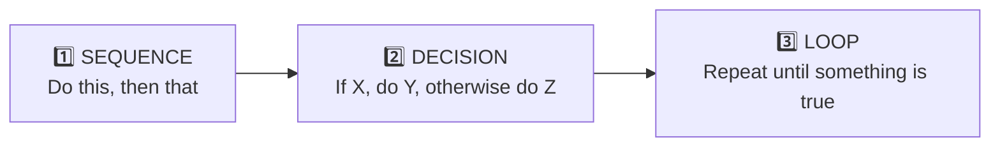
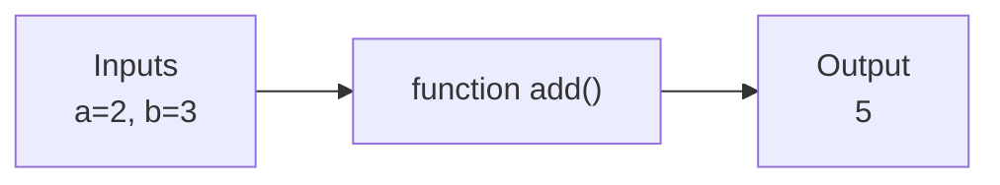
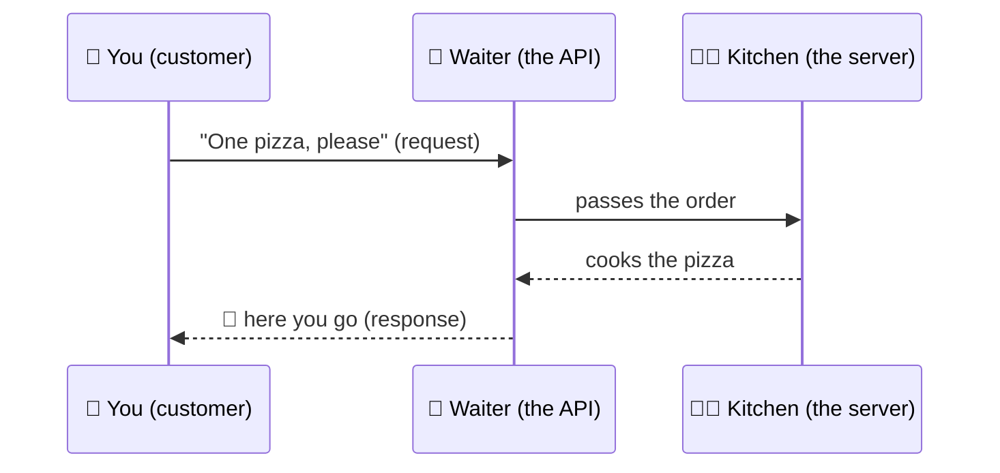
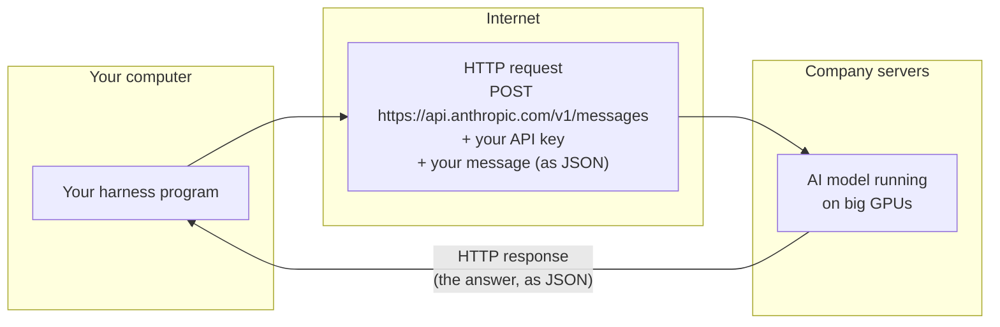

# Chapter 1: Programs, APIs & JSON

[← Back to contents](../README.md) · Next: [Chapter 2: How an LLM works →](02-how-llms-work.md)

Before we can talk about AI harnesses, we need three simple ideas. A harness is just a normal **program** that talks to an AI through an **API** using messages written in **JSON**. Let's learn each one.

---

## 1.1 What is a program?

A **program** is a list of instructions a computer follows, step by step, exactly as written.

Think of a recipe:

| Recipe | Program |
|--------|---------|
| "Boil water" | `water = boil(water)` |
| "If the pasta is soft, drain it" | `if pasta.is_soft: drain(pasta)` |
| "Stir every minute until done" | `while not done: stir()` |

Computers are fast and never get bored, but they are **not creative**. A program only does what it was told. This will matter later: the *harness* is a normal, obedient program. The *AI model* is the creative part.

### The three building blocks of every program



Almost everything, including an AI harness, is built from these three. The heart of a harness is a **loop** (Chapter 7).

### A tiny Python program

```python
# A "variable" is a labelled box that holds a value
name = "Sam"
tasks_left = 3

# A LOOP: repeat while the condition is true
while tasks_left > 0:
    print("Working on a task...")
    tasks_left = tasks_left - 1

# A DECISION
if tasks_left == 0:
    print("All done, " + name + "!")
```

Output:
```
Working on a task...
Working on a task...
Working on a task...
All done, Sam!
```

### Functions: reusable mini-programs

A **function** is a named chunk of instructions you can use again and again. You give it some inputs, and it gives you back an output.

```python
def add(a, b):        # "def" means "define a function"
    return a + b      # "return" sends the answer back

result = add(2, 3)    # result is now 5
```



> 🔑 **Key idea:** In a harness, every **tool** the AI can use (like "read a file") is just a function. The AI asks for it by name, and the harness runs the function.

---

## 1.2 What is an API?

**API** stands for *Application Programming Interface*. That's a fancy name for a simple thing:

> An API is a **menu** that one program offers to other programs, saying "here's what you can ask me to do, and here's how to ask."

### The restaurant analogy



- You don't go into the kitchen. You don't need to know how the oven works.
- You only need to know **the menu** (what you can order) and **how to order** (the format).
- The kitchen could change its oven tomorrow and you'd never notice.

When your harness wants the AI to think about something, it doesn't run the AI itself. The AI runs on big, powerful computers owned by a company like Anthropic. Your harness sends a **request** over the internet to the company's **API** and gets back a **response**.

### Requests and responses over the internet (HTTP)

The internet has a standard way for programs to send requests: **HTTP**. It's the same thing your web browser uses when it loads a page.



Three words you'll see:

| Word | Meaning | Analogy |
|------|---------|---------|
| **Endpoint** | The web address you send the request to | The restaurant's address |
| **API key** | A secret password proving it's you (and who pays) | Your credit card. **Never share it or put it in public code!** |
| **Request / Response** | The message you send / the message you get back | Your order / your food |

---

## 1.3 What is JSON?

Programs need a shared format for writing down data so both sides understand it. The most popular one is **JSON** (*JavaScript Object Notation*). It's just text, organised with a few symbols.

```json
{
  "name": "Sam",
  "age": 25,
  "is_learning": true,
  "skills": ["python", "reading"],
  "address": {
    "city": "Paris",
    "country": "France"
  }
}
```

The rules:

| Symbol | Meaning | Example |
|--------|---------|---------|
| `{ }` | An **object**: a collection of labelled values | `{"city": "Paris"}` |
| `"key": value` | A **label** and its **value** | `"age": 25` |
| `[ ]` | A **list** (array) of values, in order | `["python", "reading"]` |
| `"text"` | A **string** (text) | `"Sam"` |
| `25`, `3.14` | Numbers | |
| `true` / `false` | Yes / no | |

Objects can hold lists, and lists can hold objects, as deep as you like. That's it. You now know JSON.

> 🔑 **Key idea:** Everything between a harness and an AI model travels as JSON: your messages, the model's replies, and the **tool requests** the model makes. When the model wants to read a file, it produces JSON like:
> ```json
> {"type": "tool_use", "name": "read_file", "input": {"path": "notes.txt"}}
> ```
> The harness reads that JSON and does the actual work.

In Python, a JSON object becomes a **dictionary** (`dict`) and a JSON list becomes a **list**:

```python
person = {"name": "Sam", "skills": ["python", "reading"]}
print(person["name"])         # Sam
print(person["skills"][0])    # python  (lists count from 0!)
```

---

## 1.4 Other small things worth knowing

You'll meet these in later chapters. You don't need to master them now; just know they exist.

| Thing | Plain-English meaning | Why a harness cares |
|-------|----------------------|--------------------|
| **Terminal / shell** | A text window where you type commands to your computer, like `ls` (list files) | Coding harnesses let the AI run shell commands |
| **File system** | The folders and files on your computer | Harnesses let the AI read and write files |
| **Environment variable** | A named setting stored outside your code, like `ANTHROPIC_API_KEY` | The safe place to keep your API key |
| **Git** | A tool that saves snapshots ("commits") of your code so you can undo | A safety net when an AI edits your code |
| **Process** | A program that is currently running | The harness is a process; commands it runs are more processes |

## 🧪 Try it

1. Write a JSON object describing your favourite movie, with a title, a year, and a list of actors.
2. In your own words, explain to a friend what an API is using a *different* analogy than a restaurant. (A vending machine? A post office?)

## ✅ Chapter summary

- A **program** follows instructions exactly; built from sequence, decisions, and loops.
- A **function** is a reusable named chunk of code. Tools are functions.
- An **API** is a menu of things one program can ask another to do.
- Your harness talks to the AI model over the internet with **HTTP requests**, using an **API key**.
- Data travels as **JSON**: `{}` objects, `[]` lists, `"key": value` pairs.

[← Back to contents](../README.md) · Next: [Chapter 2: How an LLM works →](02-how-llms-work.md)
