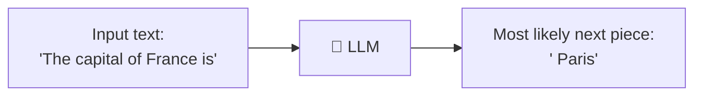
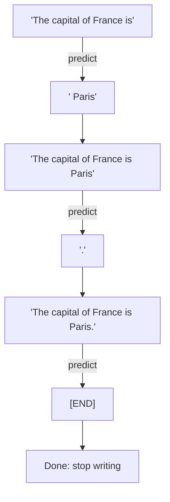
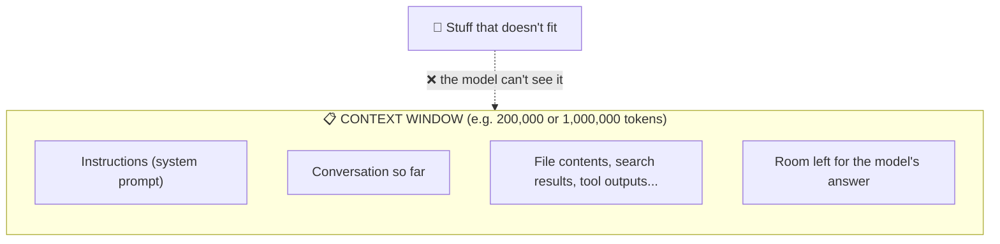
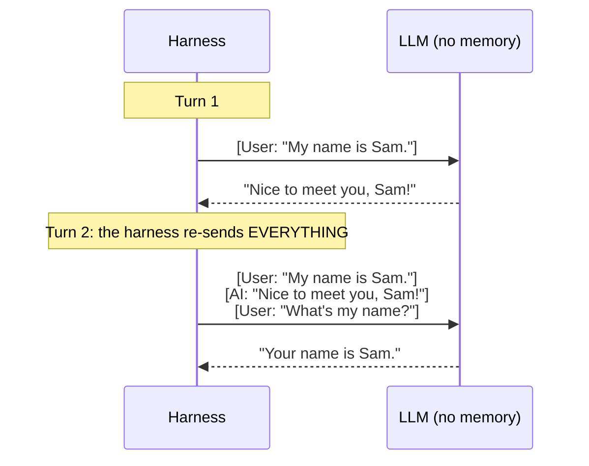
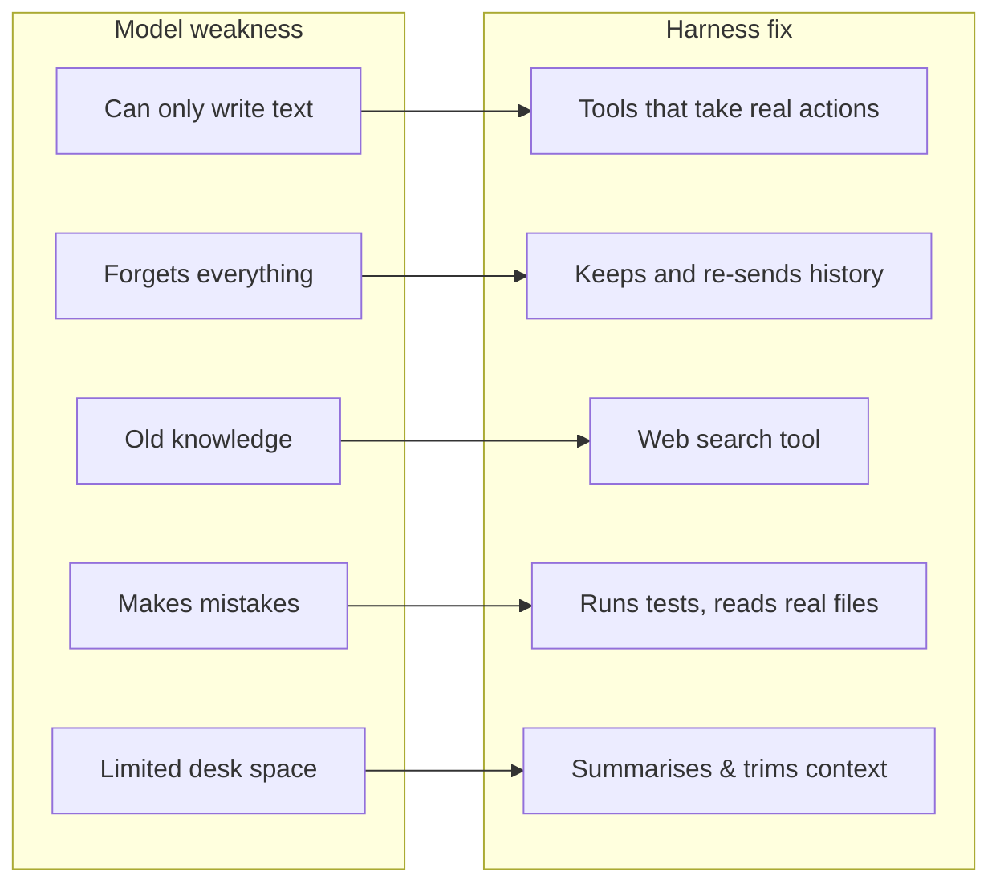

# Chapter 2: How an LLM Actually Works

[← Chapter 1](01-programs-apis-json.md) · [Contents](../README.md) · Next: [Chapter 3: Calling an LLM API →](03-calling-an-llm-api.md)

The AI model at the centre of a harness is an **LLM**, a *Large Language Model*. Examples: Claude, GPT, Gemini, Llama. You don't need the maths. You need a good **mental model** of what it can and can't do, because the harness exists to cover what it can't.

---

## 2.1 The one thing an LLM does: predict the next piece of text

An LLM is a giant prediction machine. You give it some text, and it guesses **what text comes next**.

Your phone's keyboard does a tiny version of this when it suggests the next word. An LLM is the same idea, trained on a huge amount of text (books, websites, code) so its guesses are very, very good.



It writes long answers by doing this **over and over**, adding each new piece to the end and predicting again:



Because it learned from so much human writing, "predicting the next word" turns out to include reasoning, writing code, summarising, translating and planning. But the core action is always: **text in → text out**.

> 🔑 **Key idea:** An LLM cannot *do* anything by itself. It cannot open a file, visit a website, or run a program. It can only **write text**. Everything else comes from the harness around it.

---

## 2.2 Tokens: how the model sees text

LLMs don't read letters or whole words. They read **tokens**, which are chunks of text, often part of a word.

```
"Harnesses are unbelievably useful!"

 ┌────────┬──────┬─────┬──────┬────────┬───────┬─────────┬───┐
 │ Har    │ ness │ es  │ are  │ unbel  │ ievab │ ly use  │ ...
 └────────┴──────┴─────┴──────┴────────┴───────┴─────────┴───┘
   (the exact splits depend on the model)
```

Rules of thumb for English:
- **1 token ≈ ¾ of a word** (or about 4 characters)
- **100 tokens ≈ 75 words**
- A 300-page book ≈ 100,000 to 150,000 tokens

Tokens matter because:
1. **You pay per token**, both for what you send (input) and what the model writes (output).
2. **The model's memory is measured in tokens** (next section).
3. **Speed** depends on how many tokens the model has to write.

---

## 2.3 The context window: the model's desk

The **context window** is the maximum amount of text (in tokens) the model can look at in one go. Think of it as the size of the model's **desk**. Everything it needs to think about has to fit on the desk at once.



Modern models have big desks (hundreds of thousands, even a million tokens), but a coding agent working on a large project can still fill it up. Reading big files and long command outputs eats space quickly. Managing the desk is one of the main jobs of a harness (Chapter 8).

---

## 2.4 The model has no memory between calls (it's "stateless")

This is **the most important fact** in this chapter, and the one most beginners find surprising.

Every time you send a request to an LLM, it starts **completely fresh**. It does not remember your previous request. It has no "session" or "memory" of its own.

> 📞 **Analogy:** Imagine calling a brilliant expert who has total amnesia. Every call, they've forgotten everything. So every time you call, you must **read them the entire conversation so far** before asking your next question.

So how do chat apps "remember" what you said? **The app (the harness!) re-sends the entire conversation every time.**



> 🔑 **Key idea:** The model is **stateless**. The **harness** keeps the history, decides what goes into each request, and sends it all again every time. "Memory" in AI apps is always a harness feature, never a model feature.

This is why the conversation grows bigger with each turn, and why the context window eventually fills up.

---

## 2.5 Randomness, knowledge cutoff, and mistakes

A few more properties to know:

| Property | What it means | What the harness does about it |
|----------|--------------|-------------------------------|
| **It's a bit random** | Ask the same question twice and you might get slightly different answers | Tests and checks results instead of assuming |
| **Knowledge cutoff** | It only knows about the world up to when it was trained | Gives it tools like **web search** for fresh information |
| **It can be confidently wrong** ("hallucination") | It may invent a function name or a fact that sounds right | Lets it **run the code** or **read the real file** so it can check itself |
| **It can't see your computer** | It doesn't know what files you have | Gives it tools to **list and read files** |
| **"Thinking"** | Many modern models can reason privately before answering | The harness can turn this up or down (more thinking = better but slower and more expensive) |

Notice the pattern: **every weakness of the model is covered by a harness feature.** That's the whole point of a harness.



## 🧪 Try it

1. Open any chat AI. Tell it a made-up fact ("my cat is named Pickle"). Then start a **new chat** and ask what your cat's name is. It won't know, because the new chat didn't re-send the old conversation.
2. Estimate: how many tokens is this chapter? (Hint: count roughly how many words, multiply by 4/3.)

## ✅ Chapter summary

- An LLM **predicts the next token**, over and over. Text in, text out. Nothing else.
- Text is measured in **tokens** (≈ ¾ of a word). You pay per token.
- The **context window** is the model's desk: everything must fit on it at once.
- The model is **stateless**. It forgets everything between requests. The harness re-sends the history.
- Every model weakness is patched by a harness feature.

[← Chapter 1](01-programs-apis-json.md) · [Contents](../README.md) · Next: [Chapter 3: Calling an LLM API →](03-calling-an-llm-api.md)
