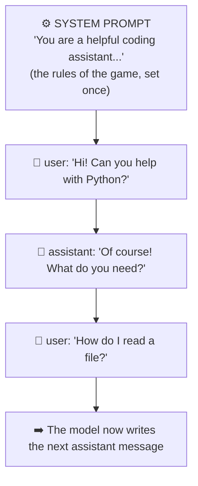
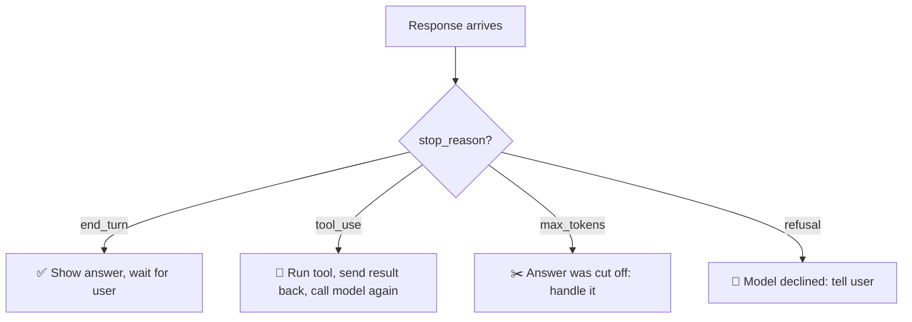
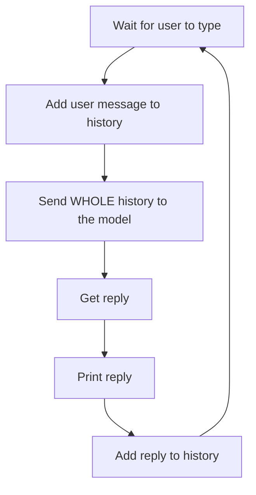

# Chapter 3: Talking to an LLM Through an API

[← Chapter 2](02-how-llms-work.md) · [Contents](../README.md) · Next: [Chapter 4: Prompts, context & tokens →](04-prompts-context-tokens.md)

Now we combine Chapters 1 and 2: a program sends text to an LLM through an API and gets text back. This is the **single most important building block** of a harness. A harness makes this call over and over, in a loop.

---

## 3.1 The shape of a conversation: messages and roles

LLM APIs don't take one big blob of text. They take a **list of messages**, and each message has a **role** saying who "said" it.

| Role | Who is speaking | Example |
|------|----------------|---------|
| **system** | The developer / harness, giving standing instructions | "You are a helpful coding assistant. Be concise." |
| **user** | The human (or the harness speaking on their behalf) | "Fix the bug in app.py" |
| **assistant** | The model | "I'll look at app.py first." |



The messages **alternate**: user, assistant, user, assistant... and the last one is usually from the user. The model's job is to write the next assistant message.

> 🔑 **Key idea:** The **system prompt** is the harness's most powerful steering wheel. It's where the harness tells the model who it is, what tools it has, what rules to follow, and how to behave. Real harnesses have system prompts thousands of words long.

---

## 3.2 What a request actually looks like

Here is a real request to Anthropic's Messages API, written as JSON. Don't worry about memorising it; just notice that it's the pieces we already know.

```json
{
  "model": "claude-opus-5-5",
  "max_tokens": 1024,
  "system": "You are a friendly tutor. Explain things simply.",
  "messages": [
    {"role": "user", "content": "What is a harness in AI?"}
  ]
}
```

| Field | Meaning |
|-------|---------|
| `model` | Which AI model to use |
| `max_tokens` | The most tokens the model is allowed to write in its reply (a safety cap) |
| `system` | The system prompt |
| `messages` | The conversation so far |

## 3.3 What a response looks like

```json
{
  "id": "msg_01ABC...",
  "role": "assistant",
  "content": [
    {"type": "text", "text": "An AI harness is the program around a model that..."}
  ],
  "stop_reason": "end_turn",
  "usage": {"input_tokens": 28, "output_tokens": 95}
}
```

| Field | Meaning |
|-------|---------|
| `content` | A **list of blocks**. Here there's one text block. Later we'll see **tool_use** blocks here too! |
| `stop_reason` | **Why** the model stopped writing (see below) |
| `usage` | How many tokens went in and came out, which is what you pay for |

### `stop_reason`: the most important field for a harness

The harness looks at `stop_reason` to decide what to do next.

| `stop_reason` | Meaning | What the harness does |
|---------------|---------|----------------------|
| `end_turn` | "I'm finished." | Show the answer to the user and wait |
| `tool_use` | "I want to use a tool." | Run the tool, send back the result, call again (Chapter 6 & 7) |
| `max_tokens` | "I ran out of room mid-answer." | Raise the limit or ask it to continue |
| `refusal` | "I won't do this." | Tell the user, or fall back to another model |



That `tool_use` arrow is **the seed of every AI agent**. We'll grow it in the next chapters.

---

## 3.4 Your first API call in Python

Companies provide **SDKs** (*Software Development Kits*): libraries that write the HTTP and JSON parts for you. Here's the same request using Anthropic's Python SDK.

```bash
# In your terminal: install the SDK and set your key
pip install anthropic
export ANTHROPIC_API_KEY="sk-ant-..."   # keep this secret!
```

```python
import anthropic

client = anthropic.Anthropic()   # reads ANTHROPIC_API_KEY automatically

response = client.messages.create(
    model="claude-opus-5-5",
    max_tokens=1024,
    system="You are a friendly tutor. Explain things simply.",
    messages=[
        {"role": "user", "content": "What is a harness in AI?"}
    ],
)

# content is a LIST of blocks. Modern models may put a "thinking" block
# first, so we pick out the text block rather than assuming it's first.
text = next(block.text for block in response.content if block.type == "text")

print(text)                          # the model's words
print(response.stop_reason)          # "end_turn"
print(response.usage)                # tokens used
```

That's a complete program that talks to an AI. It's about 10 lines.

## 3.5 Making it a chat: the first tiny "harness"

Remember: the model is **stateless**. To make a chat that remembers, *we* keep the list of messages and add to it each turn.

```python
import anthropic

client = anthropic.Anthropic()
messages = []                                   # ← the harness's memory

while True:                                     # ← the loop
    user_text = input("You: ")
    messages.append({"role": "user", "content": user_text})

    response = client.messages.create(
        model="claude-opus-5-5",
        max_tokens=1024,
        messages=messages,                      # ← send EVERYTHING, every time
    )

    reply = next(b.text for b in response.content if b.type == "text")
    print("AI:", reply)
    # ← remember it. We store the model's full list of blocks, unchanged,
    #   not just the text. Harnesses should never edit past turns.
    messages.append({"role": "assistant", "content": response.content})
```



Congratulations: this *is* a harness, just a very simple one. It has:
- ✅ a **loop**
- ✅ **memory** (the `messages` list)

It's missing:
- ❌ **tools** (it can't *do* anything)
- ❌ **autonomy** (it stops after every reply and waits for you)
- ❌ **context management** (the history grows forever)
- ❌ **safety** (no need yet, since it can't do anything!)

Part 2 adds each missing piece.

## 🧪 Try it

If you have an API key, run the chat program above. Then add `print(len(messages))` inside the loop and watch the history grow. Try `print(response.usage.input_tokens)` too: input tokens go up every turn, because you re-send everything.

## ✅ Chapter summary

- LLM APIs take a **list of messages** with **roles**: `system`, `user`, `assistant`.
- The **system prompt** sets the rules; it's the harness's steering wheel.
- Responses contain **content blocks**, a **stop_reason**, and **token usage**.
- `stop_reason == "tool_use"` is where agents begin.
- A chat app is a loop that keeps a message list and re-sends it every time: the simplest possible harness.

[← Chapter 2](02-how-llms-work.md) · [Contents](../README.md) · Next: [Chapter 4: Prompts, context & tokens →](04-prompts-context-tokens.md)
