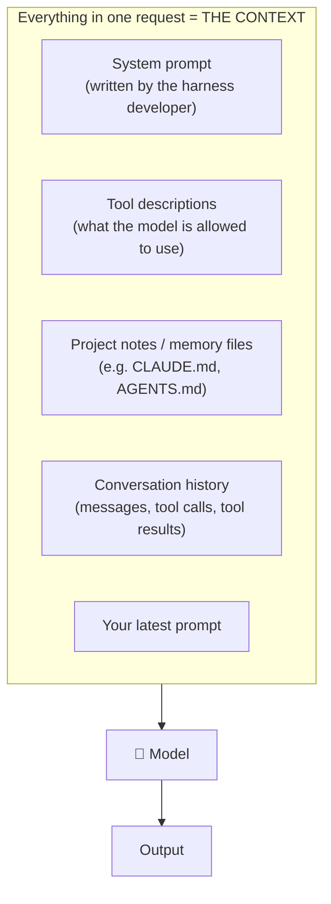
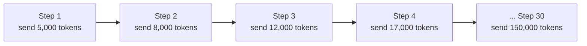
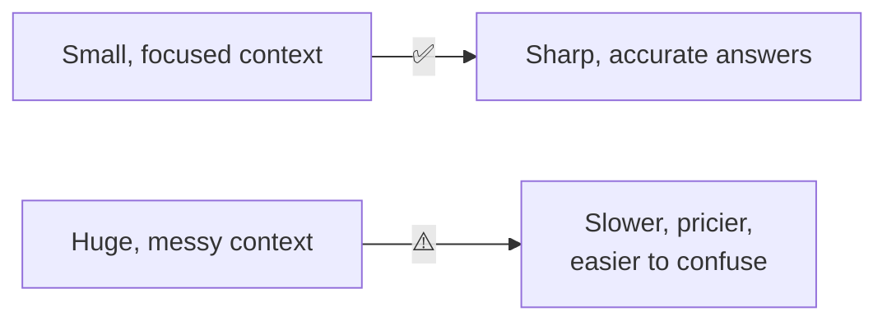

# Chapter 4: Prompts, Context & Tokens

[← Chapter 3](03-calling-an-llm-api.md) · [Contents](../README.md) · Next: [Chapter 5: What is a harness? →](../part-2-harness/05-what-is-a-harness.md)

This is the last prerequisite. It's about **what you put in front of the model**, because the quality of what goes *in* decides the quality of what comes *out*. A harness is, in large part, a machine for building good inputs.

---

## 4.1 Prompt vs. context

- A **prompt** is the text you write to ask the model something.
- The **context** is *everything* the model sees in a request: the system prompt, the whole conversation, file contents, tool results, all of it.

In a simple chat, your prompt is most of the context. In an agent harness, **your prompt might be 1% of the context**. The other 99% is assembled by the harness. This is why people now talk about **context engineering** instead of just "prompt engineering".

> 🔑 **Key idea:** The model can only use what's in its context. If the right information isn't on the desk, the model can't use it. If the desk is full of junk, the model gets distracted. The harness's job is to put **the right things** on the desk.

---

## 4.2 Writing good instructions (for prompts *and* system prompts)

Treat the model like a **very smart new colleague on their first day**. They're capable but know nothing about your project.

| ❌ Weak | ✅ Strong | Why |
|--------|----------|-----|
| "Fix the code." | "The login page crashes when the password is empty. Find the cause in `auth.py` and fix it. Run `pytest tests/test_auth.py` to confirm." | Specific goal, location, and a way to check |
| "Write good code." | "Match the style of the surrounding code. Use type hints. Don't add new libraries." | Concrete, checkable rules |
| "Don't do bad stuff." | "Never delete files outside the `project/` folder. Ask before running `git push`." | Clear boundaries |
| (no context) | "This is a Flask web app for a bakery. The database is SQLite." | Background the model can't guess |

A good instruction usually says:
1. **The goal**: what "done" looks like
2. **The context**: background the model can't know
3. **The constraints**: rules and limits
4. **How to check**: tests, examples, or a success condition

---

## 4.3 Tokens = money and time

Every request costs money based on tokens. Rough idea of how it adds up for an **agent**:

Because the harness **re-sends the whole history every step**, and the history keeps growing, costs can grow quickly across a long task. Harnesses fight this with three tricks:

| Trick | Plain-English meaning |
|-------|----------------------|
| **Prompt caching** | The API remembers the *start* of your request (which doesn't change between steps) and charges much less to re-read it. Like a bookmark: "you already read pages 1–50, skip to page 51." For this to work, the start must stay **exactly** the same, byte for byte. |
| **Compaction** | When the history gets long, the harness asks the model to write a summary, then replaces the old history with that summary. |
| **Trimming tool output** | Don't paste a 10,000-line log into context; paste the last 50 lines, or let the model search it. |

We'll come back to all of these in [Chapter 8](../part-2-harness/08-context-engineering.md).

---

## 4.4 "Context rot": more isn't always better

Even with a huge context window, stuffing it full makes the model **worse**, not better. Important details get lost in the noise, the same way you'd miss one key sentence in a 500-page printout.

> 🔑 **Key idea:** Good harnesses keep context **small and relevant**. They load information *when it's needed* (just-in-time) instead of dumping everything in at the start.

## 🧪 Try it

Take a vague request you might give an AI ("make my website better") and rewrite it using the four parts: goal, context, constraints, how to check.

## ✅ Chapter summary

- **Context** = everything the model sees. Your prompt is only one part.
- Good instructions state the **goal, context, constraints, and how to check**.
- Agents re-send growing history, so **tokens add up**. Caching, compaction and trimming keep costs down.
- More context isn't always better. **Relevant** context is better.

## 🎓 You've finished the prerequisites!

You now understand the three facts a harness is built on:
1. The model **only writes text**.
2. The model **forgets everything** between calls.
3. The model can only use **what's in its context**.

A harness is the answer to all three. Let's meet it.

[← Chapter 3](03-calling-an-llm-api.md) · [Contents](../README.md) · Next: [Chapter 5: What is a harness? →](../part-2-harness/05-what-is-a-harness.md)
