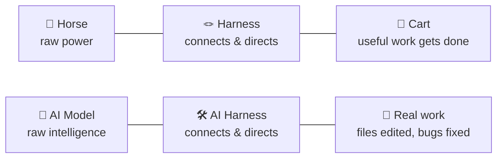
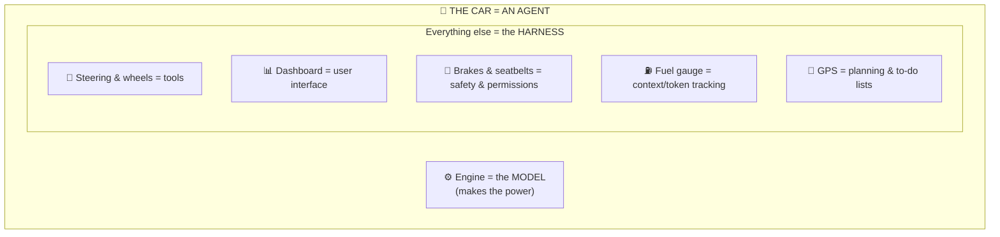
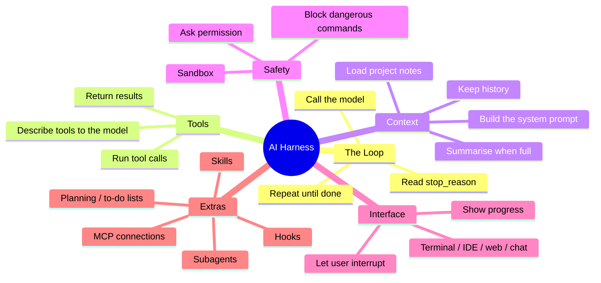
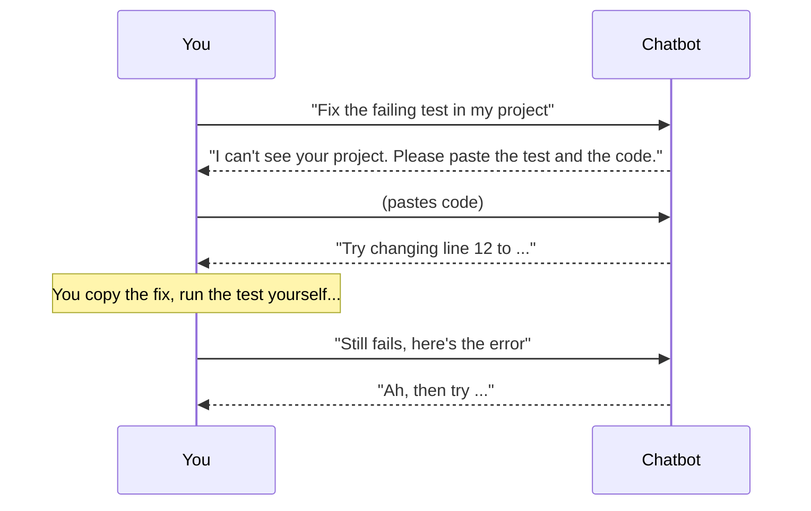
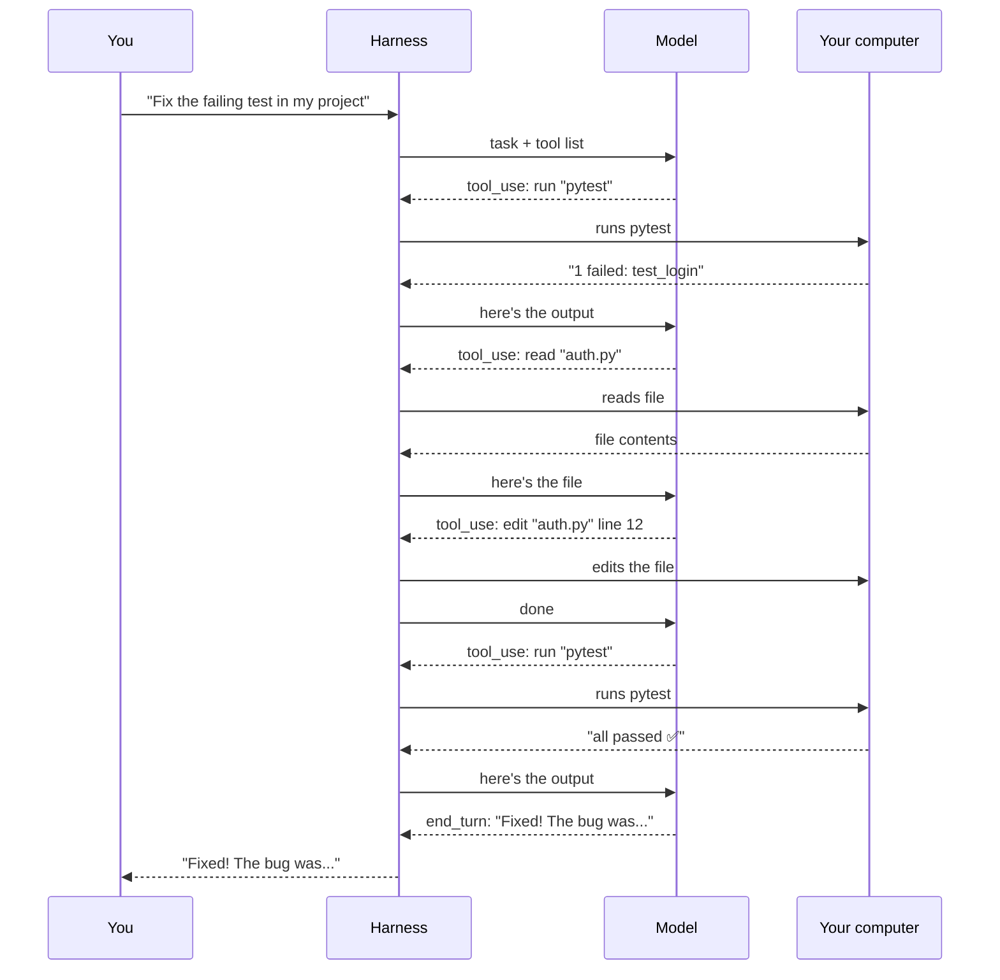
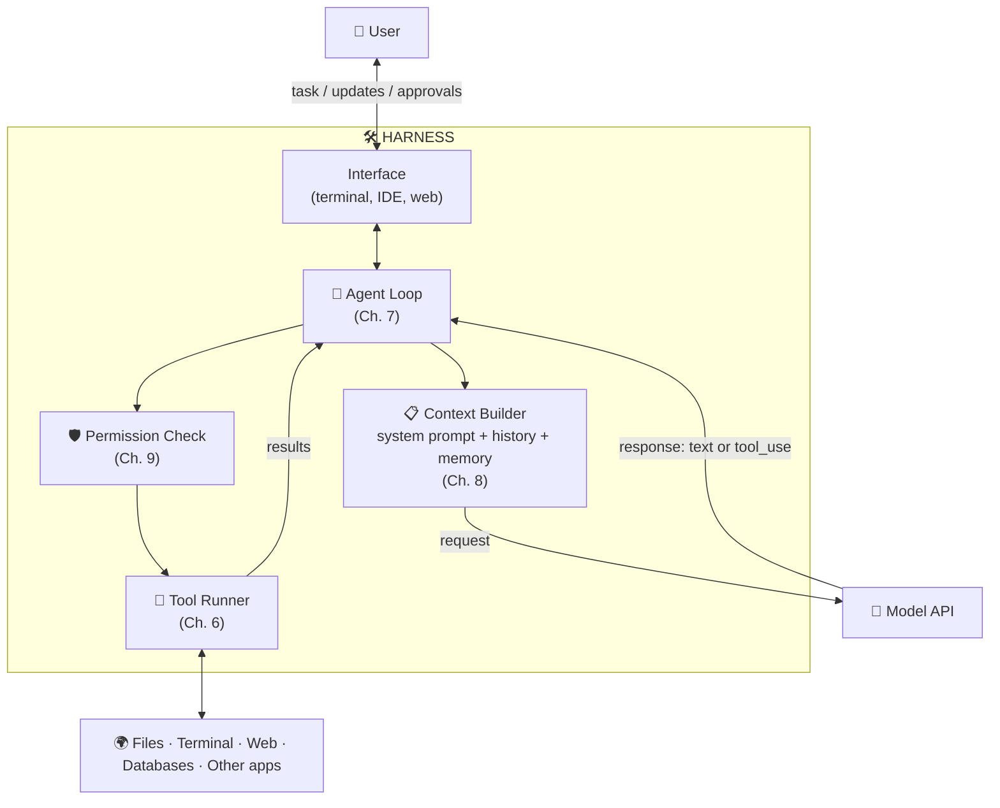

# Chapter 5: What Is an AI Harness?

[← Chapter 4](../part-1-prerequisites/04-prompts-context-tokens.md) · [Contents](../README.md) · Next: [Chapter 6: Tools →](06-tools.md)

You've finished the prerequisites. Now for the main topic.

---

## 5.1 Where the word comes from

A **harness** for a horse is the set of straps that connects the horse to a cart. The horse supplies the **power**. The harness **directs** that power into useful work: pulling the cart in the right direction without running off.

An **AI harness** is the same idea:
- The **model** supplies intelligence (reasoning, writing, planning).
- The **harness** connects that intelligence to the real world and keeps it on track.

> 🔑 **Definition:** An **AI harness** is the software around an AI model that runs it in a loop, gives it tools, manages what it sees (context), enforces safety rules, and connects it to the user and the outside world.

Other names you'll hear for the same thing or close to it: **agent harness**, **agent scaffold**, **agent framework**, **agent runtime**, **orchestrator**.

---

## 5.2 Another analogy: engine vs. car

An engine sitting on the garage floor is powerful but useless. You can't drive it anywhere. A car without an engine goes nowhere either. You need both.

> 🔑 **The famous equation:**
> # Agent = Model + Harness

Same engine, different car, very different experience. The same AI model can feel brilliant in one harness and clumsy in another. That's why companies invest so much in their harnesses.

---

## 5.3 What a harness is responsible for

Here's the full map of a harness's jobs. Each one gets its own chapter.

In one table:

| Job | Question it answers | Chapter |
|-----|---------------------|---------|
| **The loop** | "How does the model keep working without me pressing enter every step?" | 7 |
| **Tools** | "How does a text-only model *do* things?" | 6 |
| **Context management** | "How does it remember, and not run out of room?" | 8 |
| **Safety** | "How do I stop it from breaking things?" | 9 |
| **Interface** | "How do I see what it's doing and step in?" | 11 |
| **Extras** | "How does it handle big, complex jobs?" | 10 |

---

## 5.4 Chatbot vs. agent: what the harness changes

Let's compare what happens when you ask *"Fix the failing test in my project"*.

### In a plain chatbot (thin harness)

**You** are the harness. You're doing the copying, pasting, running, and reporting back.

### In an agent harness

**The harness** does the copying, pasting, running and reporting, automatically, in a loop. You just gave the goal.

> 🔑 **Key idea:** The harness turns a model from something that **talks about** work into something that **does** work.

---

## 5.5 The whole thing in one picture

Keep this diagram in mind for the rest of the guide. Every later chapter zooms into one box.

## ✅ Chapter summary

- A **harness** connects a model's intelligence to real work and keeps it on track, like a horse harness or a car around an engine.
- **Agent = Model + Harness.** The same model behaves very differently in different harnesses.
- A harness handles: **the loop, tools, context, safety, interface, and extras**.
- Without a harness, *you* do the running around. With one, the harness does it.

[← Chapter 4](../part-1-prerequisites/04-prompts-context-tokens.md) · [Contents](../README.md) · Next: [Chapter 6: Tools →](06-tools.md)
