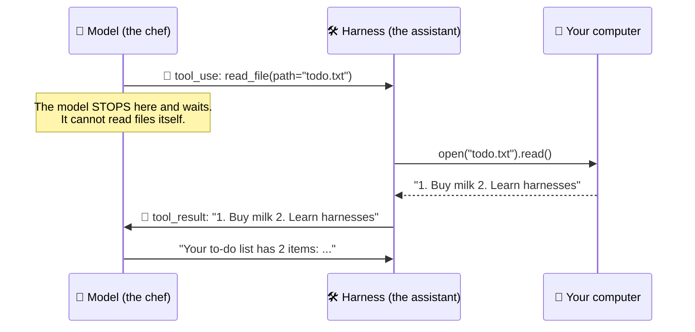
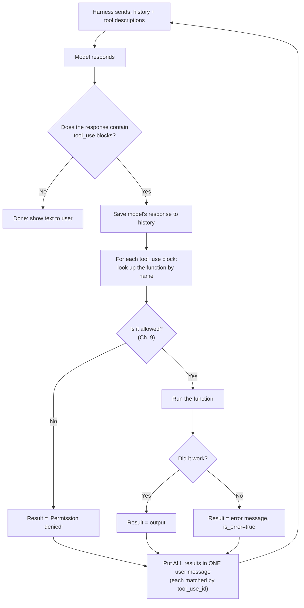
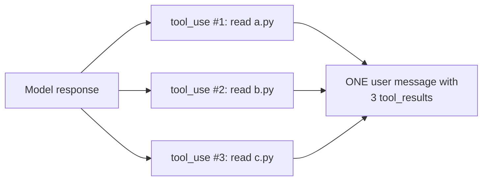

# Chapter 6: Tools: Giving the Model Hands

[← Chapter 5](05-what-is-a-harness.md) · [Contents](../README.md) · Next: [Chapter 7: The agent loop →](07-the-agent-loop.md)

We know the model can only write text. So how does an AI "read a file" or "run a command"? This chapter explains the trick. It's surprisingly simple.

---

## 6.1 The trick: the model *asks*, the harness *does*

The model never touches your computer. Instead:

1. The harness tells the model: *"You have these tools available. Here's what each one does."*
2. When the model wants to use one, it writes a special, structured **request** (a `tool_use` block) instead of normal text.
3. The **harness** sees the request, **runs the real function**, and sends the result back as a message.
4. The model reads the result and continues.

> 🍽️ **Analogy:** The model is a head chef who can't leave the office. It can only pass notes. It writes *"Get me 3 tomatoes from the fridge"* and a kitchen assistant (the harness) actually fetches them and reports back *"Here are 3 tomatoes, one is a bit soft."*



This is called **tool use** or **function calling**.

---

## 6.2 Step 1: Describing a tool to the model

The model only knows a tool exists if the harness describes it. A tool description has three parts:

```json
{
  "name": "read_file",
  "description": "Read a text file from the project and return its contents. Use this before editing a file so you know what's in it.",
  "input_schema": {
    "type": "object",
    "properties": {
      "path": {
        "type": "string",
        "description": "Path to the file, relative to the project folder, e.g. 'src/app.py'"
      }
    },
    "required": ["path"]
  }
}
```

| Part | What it's for |
|------|---------------|
| `name` | What the model calls it |
| `description` | **Plain-English instructions** for the model: what it does and *when* to use it. This matters a lot! |
| `input_schema` | The inputs it takes, written in **JSON Schema** (a standard way to describe the shape of JSON) |

> 🔑 **Key idea:** Tool descriptions are **prompts**. The model decides whether and how to use a tool entirely from its name and description. A vague description gives you a model that misuses the tool.

---

## 6.3 Step 2: The model asks for a tool

When the model decides to use a tool, its response looks like this:

```json
{
  "stop_reason": "tool_use",
  "content": [
    {"type": "text", "text": "Let me look at your to-do list."},
    {
      "type": "tool_use",
      "id": "toolu_01A",
      "name": "read_file",
      "input": {"path": "todo.txt"}
    }
  ]
}
```

Notice:
- `stop_reason` is **`tool_use`**. The model has paused, waiting for the result.
- The `tool_use` block has an **`id`**. The harness must use the same id when replying, so the model knows which result belongs to which request.
- `input` matches the schema we described.

## 6.4 Step 3: The harness runs the tool and replies

The harness:
1. Saves the model's full response into the history (unchanged).
2. Runs the real Python function `read_file("todo.txt")`.
3. Adds a new **user** message containing a `tool_result`:

```json
{
  "role": "user",
  "content": [
    {
      "type": "tool_result",
      "tool_use_id": "toolu_01A",
      "content": "1. Buy milk\n2. Learn harnesses"
    }
  ]
}
```

4. Calls the model again with the updated history.

If the tool **fails** (say the file doesn't exist), the harness doesn't crash. It sends back an error so the model can adapt:

```json
{"type": "tool_result", "tool_use_id": "toolu_01A",
 "content": "Error: file 'todo.txt' not found", "is_error": true}
```

The model will typically respond by trying something else, like listing the folder to find the right name. **Good error messages help the model fix its own mistakes.**

### The complete flow



---

## 6.5 Parallel tool calls

A model can ask for **several tools at once** in one response: *"read `a.py`, `b.py`, and `c.py`."* The harness runs them (possibly at the same time, to save time) and sends **all the results back together in one message**.



---

## 6.6 What tools do real harnesses have?

A coding harness like Claude Code ships with a set of tools roughly like this:

| Category | Example tools | What they do |
|----------|--------------|-------------|
| **Read** | `Read`, `Glob` (find files by pattern), `Grep` (search file contents) | Look around the project |
| **Write** | `Write`, `Edit` (replace exact text) | Change files |
| **Execute** | `Bash` (run a terminal command) | Run tests, install packages, use git |
| **Web** | `WebSearch`, `WebFetch` | Look things up |
| **Planning** | `TodoWrite` / task lists | Keep track of multi-step work |
| **Delegation** | `Task` / `Agent` (start a subagent) | Hand off a sub-job (Ch. 10) |
| **External** | MCP tools (Ch. 10) | Talk to GitHub, Slack, databases... |

### Design lesson: few powerful tools vs. many specific tools

| | Option A: one general tool (`bash`, can do anything) | Option B: many specific tools (`read_file`, `edit_file`, `search`...) |
|---|---|---|
| **Flexibility** | ➕ Very flexible | ➖ Only does what you built |
| **Safety** | ➖ Hard to check what a command will do | ➕ Easy to give each tool its own permission |
| **Display** | ➖ Hard to show nicely to the user | ➕ Easy to show ("edited line 12 of app.py") |
| **Prompt size** | ➕ One short description | ➖ More descriptions to include |

Most good harnesses mix both: a **bash** tool for flexibility, plus **dedicated tools** for the most common actions (reading, editing, searching) because they're safer, cheaper, and easier to show to the user.

### Tips for designing good tools

1. **Clear names and descriptions.** Say *when* to use it, not just what it does.
2. **Helpful error messages.** "File not found. Did you mean `src/todo.txt`?" beats "Error 2".
3. **Keep outputs short.** Cut huge outputs and say so ("...showing first 200 of 5,000 lines").
4. **Make inputs hard to get wrong.** Use clear parameter names and examples.
5. **Don't overlap.** Two tools that do nearly the same thing confuse the model.

## 🧪 Try it

Write a tool description (name, description, input_schema) for a tool called `get_weather` that takes a city name and returns the temperature. Think hard about the description: when should the model use it?

## ✅ Chapter summary

- The model **asks** for tools with a `tool_use` block. The **harness** runs them.
- A tool = **name + description + input schema**. The description is a prompt.
- The harness replies with a `tool_result` that has the matching `tool_use_id`. Errors go back too, marked `is_error`.
- The model can call **several tools at once**. Send all results back in **one** message.
- Good tools have clear descriptions, helpful errors, and short outputs.

[← Chapter 5](05-what-is-a-harness.md) · [Contents](../README.md) · Next: [Chapter 7: The agent loop →](07-the-agent-loop.md)
