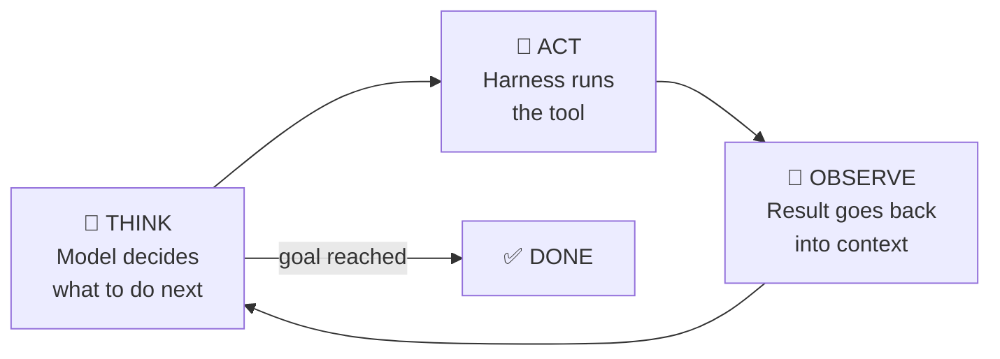
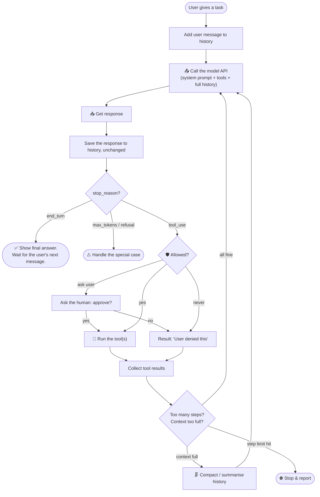
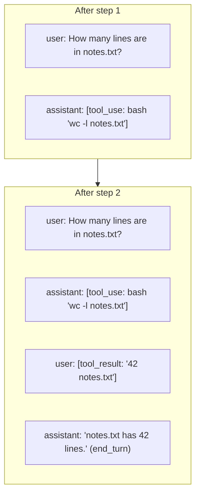
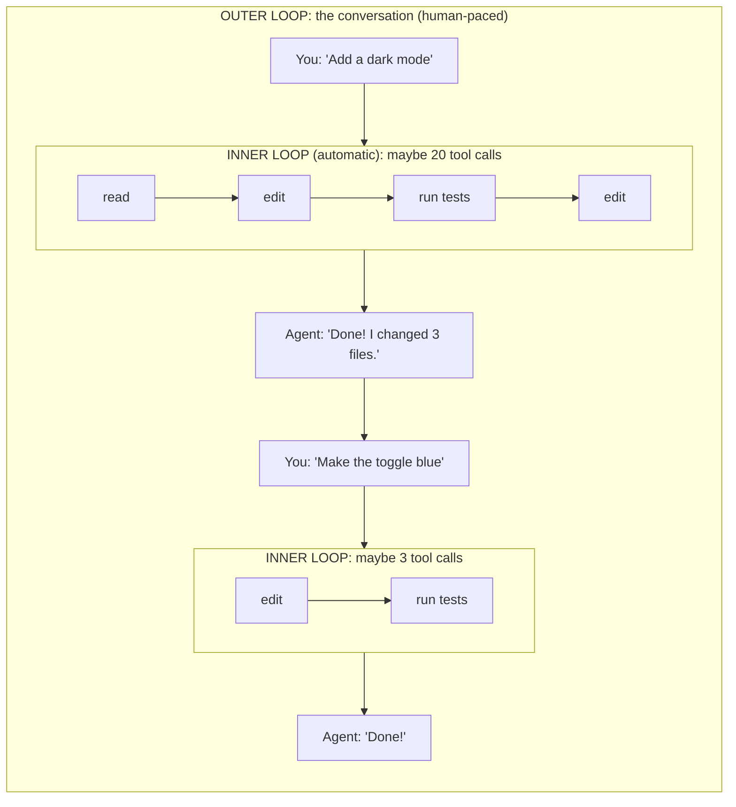

# Chapter 7: The Agent Loop, the Heartbeat of a Harness

[← Chapter 6](06-tools.md) · [Contents](../README.md) · Next: [Chapter 8: Context engineering →](08-context-engineering.md)

If you remember one diagram from this whole guide, make it the one in this chapter. **The agent loop is what turns a model into an agent.**

---

## 7.1 The idea: think → act → observe → repeat

A human fixing a bug doesn't do it in one step. They look at the error, open a file, try a change, run the test, look again... The agent loop lets the model work the same way.



This pattern is sometimes called **ReAct** (*Reason + Act*), from a 2022 research paper. Today it's simply "the agent loop", and nearly every agent harness is built around it.

---

## 7.2 The loop in detail

Here's exactly what the harness does, step by step:



Notice **who decides what**:

| Decision | Made by |
|----------|---------|
| *Which* tool to use and with *what* inputs | 🧠 **The model** |
| *When* the job is done | 🧠 **The model** (by replying without a tool call) |
| *Whether* a tool is allowed to run | 🛠️ **The harness** (and the user) |
| *How* the tool actually runs | 🛠️ **The harness** |
| *When* to stop because of limits | 🛠️ **The harness** |
| *What* goes in the context | 🛠️ **The harness** |

> 🔑 **Key idea:** The model is the **brain** that decides. The harness is the **body and the rules**. The model steers, and the harness keeps it on the road.

---

## 7.3 The loop in code

Here's the real thing in Python, stripped to its bones. (The full, runnable version is in [Part 3](../part-3-build/12-build-your-own.md).)

```python
messages = [{"role": "user", "content": task}]

while True:
    # 1. THINK: call the model with everything so far
    response = client.messages.create(
        model="claude-opus-5-5",
        max_tokens=16000,
        system=SYSTEM_PROMPT,
        tools=TOOLS,
        messages=messages,
    )

    # 2. Save the model's turn to history, exactly as it came back
    messages.append({"role": "assistant", "content": response.content})

    # 3. Is the model finished?
    if response.stop_reason != "tool_use":
        break

    # 4. ACT: run every tool the model asked for
    results = []
    for block in response.content:
        if block.type == "tool_use":
            output = run_tool(block.name, block.input)       # ← the harness does the work
            results.append({
                "type": "tool_result",
                "tool_use_id": block.id,
                "content": output,
            })

    # 5. OBSERVE: hand the results back, then loop
    messages.append({"role": "user", "content": results})

print("Final answer:", [b.text for b in response.content if b.type == "text"])
```

That's it. **About 25 lines is the core of every AI coding agent in the world.** Everything else is making those 25 lines safer, smarter, cheaper and nicer to use.

---

## 7.4 Watching the history grow

Let's trace a real run. Task: *"How many lines are in notes.txt?"*



Every step **adds** to the list. The list is the agent's short-term memory. The model sees the whole list every time it thinks.

> 💡 Notice tool results are sent with the **user** role, even though no human typed them. From the API's point of view, anything that isn't the model is the "user" side.

---

## 7.5 How the loop ends (and how it goes wrong)

A healthy loop ends when the model replies **without asking for a tool**, which means "I'm done."

But things can go wrong, so harnesses add **guard rails**:

| Problem | What it looks like | Harness guard rail |
|---------|-------------------|-------------------|
| **Infinite loop** | The model keeps trying the same failing thing | A **maximum number of steps** |
| **Runaway cost** | A long task burns through tokens | A **token or money budget** |
| **Stuck forever** | A command never finishes (like a server) | **Timeouts** on tools |
| **Wrong direction** | The model misunderstood the task | Let the user **interrupt** at any time |
| **Giving up too early** | The model says "done" but the tests fail | Tell it in the system prompt to **verify** its work; some harnesses run checks automatically (hooks, Ch. 10) |

---

## 7.6 Turns inside turns

Two different "loops" are going on, and it helps to keep them apart:



- The **inner loop** is the agent loop: model ↔ tools, automatic, many steps.
- The **outer loop** is you ↔ the agent: one message from you can trigger dozens of inner steps.

## 🧪 Try it

On paper, trace the agent loop for the task *"Create a file called hello.py that prints Hello, then run it."* Write down each model response (text or tool_use) and each tool_result. How many trips around the loop does it take? (Answer: about 3: write the file, run it, then a final "done" message.)

## ✅ Chapter summary

- The **agent loop**: call model → if it asks for tools, run them → send results → repeat → stop when it answers without tools.
- The **model decides** what to do and when it's done. The **harness decides** what's allowed and runs everything.
- The core loop is ~25 lines of code. The rest of a harness makes it safe, smart and usable.
- Guard rails: step limits, budgets, timeouts, interrupts, verification.

[← Chapter 6](06-tools.md) · [Contents](../README.md) · Next: [Chapter 8: Context engineering →](08-context-engineering.md)
