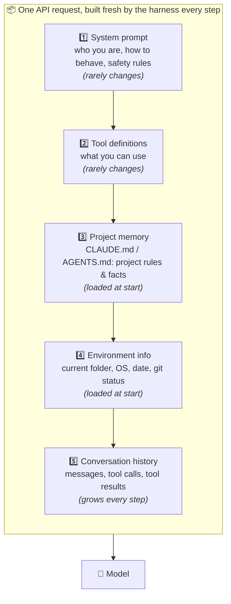
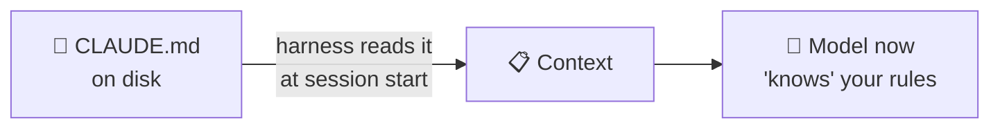
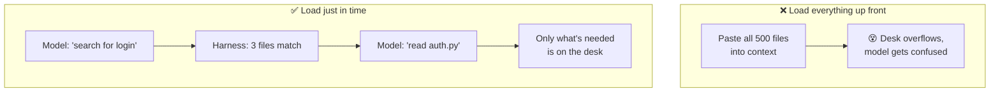
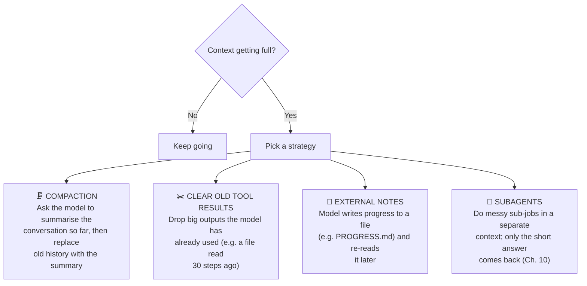
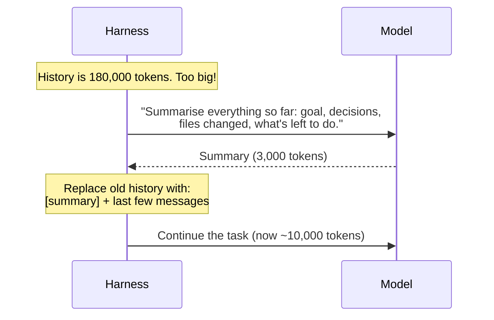
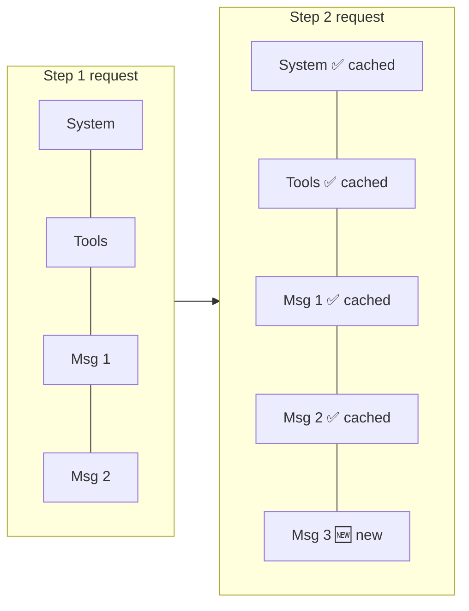

# Chapter 8: Context Engineering: Managing the Model's Memory

[← Chapter 7](07-the-agent-loop.md) · [Contents](../README.md) · Next: [Chapter 9: Safety →](09-safety-permissions-sandboxes.md)

In Chapter 2 we learned the model has a limited **desk** (the context window) and **no memory** between calls. In Chapter 7 we saw the history grows every step. Put those together and you have the biggest engineering challenge in a harness:

> **How do you fit a long, complex job onto a limited desk, and make sure the right things are on it?**

That's **context engineering**.

---

## 8.1 What goes into each request

Every time the loop calls the model, the harness assembles the request from several layers:



The **top** layers are stable. The **bottom** layer grows. This ordering is deliberate: it makes **prompt caching** work (see 8.5).

---

## 8.2 Project memory files (CLAUDE.md, AGENTS.md)

Since the model forgets everything between sessions, how does it learn *your* project's rules, like "we use tabs" or "run tests with `make test`"?

**Answer: a plain text file the harness reads automatically at the start of every session.**

| Harness | File name |
|---------|-----------|
| Claude Code | `CLAUDE.md` |
| OpenAI Codex and many others | `AGENTS.md` |
| Cursor | `.cursor/rules/` |
| GitHub Copilot | `.github/copilot-instructions.md` |

Example `CLAUDE.md`:

```markdown
# Project: Bakery Website

## Commands
- Run tests: `pytest`
- Start the server: `flask run`

## Rules
- Use type hints in all new Python code.
- Never edit files in `migrations/` by hand.
- The database is SQLite in `data/app.db`.
```



> 🔑 **Key idea:** The model's "long-term memory" is really just **files the harness chooses to load into context**. Want the agent to remember something forever? Write it in a file the harness loads.

---

## 8.3 Just-in-time loading: don't read the whole library

A beginner's harness might paste the *entire project* into the context at the start. That's a bad idea: it's expensive, it may not fit, and it buries the important parts (context rot, Chapter 4).

Modern harnesses do **just-in-time** (agentic) loading: they give the model **search tools** and let it fetch only what it needs.



This is exactly how a human developer works in a big codebase: you don't read everything; you search, then open the few files that matter.

---

## 8.4 When the desk fills up: compaction

On long tasks, even careful loading eventually fills the context. Harnesses have several strategies:



### Compaction, step by step



**The trade-off:** summaries lose detail. A good compaction keeps the **goal, key decisions, current state, and next steps**, and drops the noise (old file contents, long logs). Some APIs can also do compaction for you on the server side.

---

## 8.5 Prompt caching: why order matters

Each step re-sends the whole context. That's a lot of repeated reading. **Prompt caching** lets the API remember the *beginning* of your request and skip re-processing it, which makes it much cheaper and faster.

The catch: the cache only works for the **exact same beginning**. Change one character near the top and everything after it must be re-read.



Rules that fall out of this:

| ✅ Do | ❌ Don't |
|------|---------|
| Keep the system prompt **frozen** during a session | Put the current time (to the second) in the system prompt |
| Keep the tool list **the same** every step | Add or remove tools mid-conversation |
| Only **add to the end** of the history | Edit or delete old messages (unless compacting) |

> 🔑 **Key idea:** A well-built harness treats the history as **append-only**: it adds new messages to the end and doesn't rewrite the past. That keeps the cache warm and the model's own reasoning trail intact.

---

## 8.6 Planning and to-do lists: context for the future

For long tasks, the model can lose track of the plan. Many harnesses give the model a **to-do list tool**. The model writes its plan, checks items off, and the list stays visible in context.

```
📋 Tasks
 ✅ 1. Find where login is handled
 ✅ 2. Reproduce the bug with a test
 🔄 3. Fix the empty-password check      ← in progress
 ⬜ 4. Run the full test suite
 ⬜ 5. Summarise changes for the user
```

This helps the model (it stays on track) *and* the user (they can see progress).

## ✅ Chapter summary

- **Context engineering** = putting the right things on the model's desk, and nothing else.
- Each request is built in layers: **system prompt → tools → project memory → environment → history**.
- **Memory files** (CLAUDE.md / AGENTS.md) give the agent long-term knowledge about your project.
- Load information **just in time** with search tools, not all up front.
- When context fills up: **compact**, **clear old tool results**, **write notes to files**, or use **subagents**.
- Keep the start of the request stable and **append only** so **prompt caching** works.

[← Chapter 7](07-the-agent-loop.md) · [Contents](../README.md) · Next: [Chapter 9: Safety →](09-safety-permissions-sandboxes.md)
