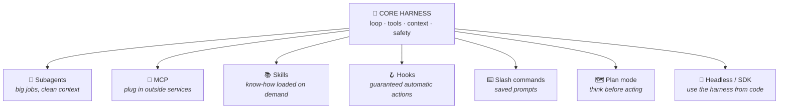
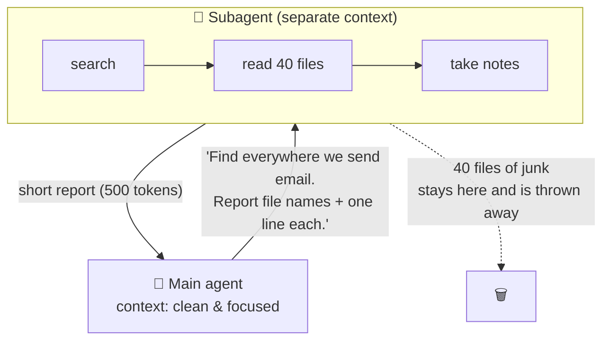
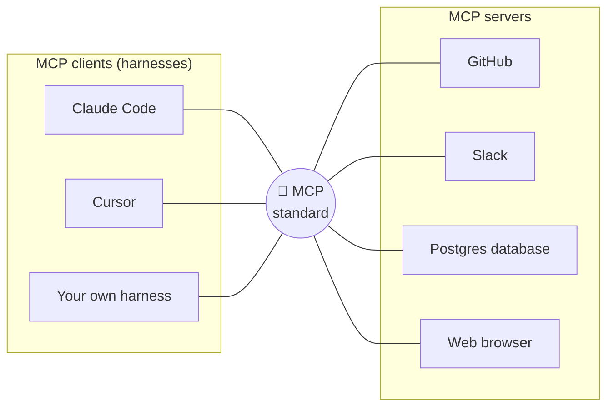
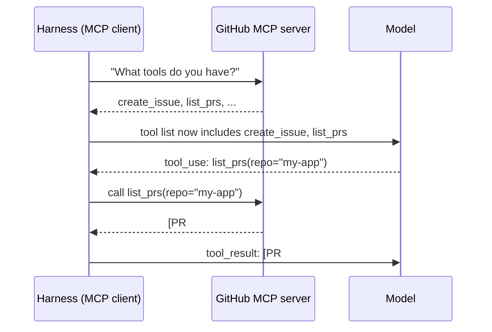
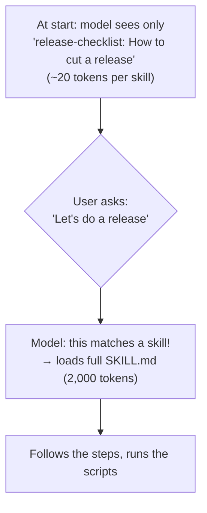
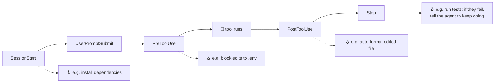
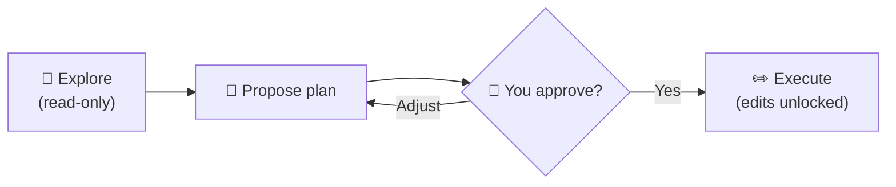
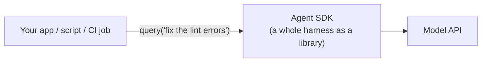
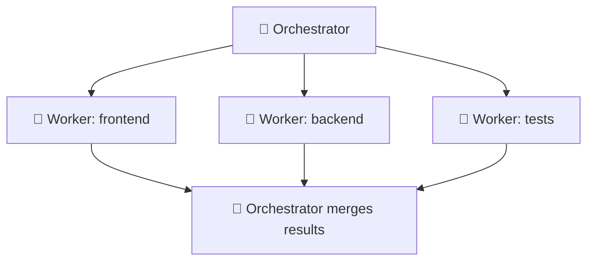

# Chapter 10: Power Features: Subagents, MCP, Skills, Hooks & More

[← Chapter 9](09-safety-permissions-sandboxes.md) · [Contents](../README.md) · Next: [Chapter 11: Real harnesses →](11-real-harnesses.md)

You now know the core: **loop + tools + context + safety**. Modern harnesses add a set of power features on top. Each one solves a specific problem. For each, we'll ask: *what problem does it solve?*



---

## 10.1 Subagents: delegating to a helper

**Problem:** Some sub-jobs are messy. *"Search the whole codebase for every place we send email"* might mean reading 40 files. If the main agent does that itself, its context fills with junk it only needed briefly.

**Solution:** The main agent starts a **subagent**: a fresh copy of the loop with its **own, empty context**. The subagent does the messy work and returns only a **short summary**.



Benefits:
- 🧹 **Clean context** for the main agent
- ⚡ **Parallel work**: start several subagents at once ("research these 5 libraries")
- 🎯 **Specialisation**: a subagent can have its own system prompt and tools (e.g. a "code reviewer" that can only read)

> 🔑 **Key idea:** Subagents are a **context management** tool. They let the harness spend lots of tokens on a sub-problem without polluting the main conversation.

---

## 10.2 MCP (Model Context Protocol): a universal plug

**Problem:** You want your agent to use GitHub, Slack, Google Drive, your database, a browser... Writing a custom tool for every service in every harness is endless work.

**Solution:** **MCP** is an open standard (introduced by Anthropic in 2024 and now widely adopted) for connecting AI harnesses to outside tools and data. Think of it as **USB-C for AI**: any MCP-compatible harness can plug into any MCP server.



How it works, simply:



The model doesn't know or care that a tool comes from MCP. To the model, it's just another tool in the list. The **harness** does the plumbing.

---

## 10.3 Skills: know-how on demand

**Problem:** You want the agent to know *how* to do many specialised things (make a PowerPoint, follow your company's release checklist, use a tricky API). But putting all those instructions in the system prompt would bloat every request.

**Solution:** A **skill** is a folder with a `SKILL.md` file (instructions) and, optionally, scripts and reference files. The harness only shows the model a **one-line description** of each skill. The full instructions are loaded **only when needed**.

```
my-skills/
└── release-checklist/
    ├── SKILL.md          ← "name, description" + the full instructions
    └── scripts/
        └── bump_version.py
```



This is called **progressive disclosure**: show the headline first, the details only when relevant. It's context engineering again!

---

## 10.4 Hooks: guaranteed automatic actions

**Problem:** You tell the model "always run the formatter after editing a file". Usually it does... but not *always*. Models are probabilistic.

**Solution:** A **hook** is a script the **harness** runs automatically at specific moments. It isn't a request to the model, so it *always* happens.



| Instructions in a prompt | Hooks |
|--------------------------|-------|
| "Please run the linter after edits" | The harness **always** runs the linter after edits |
| Model *may* forget | **Deterministic**: never forgets |
| Costs tokens | Runs outside the model |

> 🔑 **Key idea:** Use **prompts** for judgement ("write clean code"). Use **hooks** for rules that must never be skipped ("never edit `.env`", "always format").

---

## 10.5 Slash commands: saved prompts

**Problem:** You type the same long instruction every day ("review my changes for bugs, check tests, summarise").

**Solution:** Save it as a **slash command** (e.g. `/review`). Typing `/review` makes the harness insert the saved prompt for you. Simple, but a big quality-of-life win.

## 10.6 Plan mode: think before acting

**Problem:** For big changes, you want to agree on the approach *before* the agent edits 30 files.

**Solution:** In **plan mode**, the harness only allows read-only tools. The agent explores, then writes a plan. You approve or adjust it, and only then does the harness unlock editing tools.



## 10.7 Headless mode & SDKs: harness as a building block

**Problem:** You want to use the harness in a script, a CI pipeline, or your own app, not just by typing into it.

**Solution:** Many harnesses have a **headless mode** (run a task from the command line without an interactive screen) and an **SDK** (the harness packaged as a library). For example, the **Claude Agent SDK** is the Claude Code harness as a Python/TypeScript library: you call it from your code and get the loop, tools, context management and permissions for free.



## 10.8 Multi-agent systems

Put several of these together and you get **multi-agent** setups: an "orchestrator" agent that splits a big task, hands pieces to worker agents, and combines their results. It's powerful but costs more tokens and is harder to debug. **Start with a single agent**, and add more only when a single one clearly isn't enough.



## ✅ Chapter summary

| Feature | Problem it solves | One-liner |
|---------|-------------------|-----------|
| **Subagents** | Messy sub-jobs pollute context | A helper with its own clean desk |
| **MCP** | Connecting to many outside services | USB-C for AI tools |
| **Skills** | Lots of specialised know-how | Instructions loaded only when needed |
| **Hooks** | Rules the model might forget | Scripts the harness always runs |
| **Slash commands** | Repeating the same prompt | Saved prompts |
| **Plan mode** | Big changes without agreement | Look, plan, approve, then act |
| **Headless / SDK** | Using agents inside other programs | Harness as a library |
| **Multi-agent** | Very large tasks | A team of agents |

[← Chapter 9](09-safety-permissions-sandboxes.md) · [Contents](../README.md) · Next: [Chapter 11: Real harnesses →](11-real-harnesses.md)
