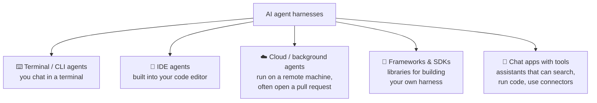
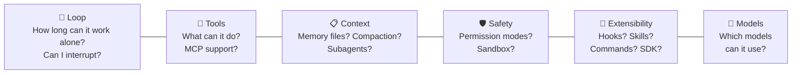
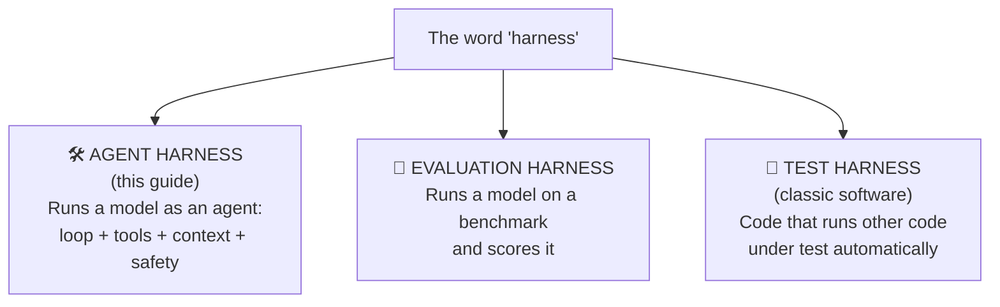
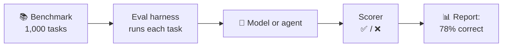

# Chapter 11: Real Harnesses, and the Other Meanings of "Harness"

[← Chapter 10](10-power-features.md) · [Contents](../README.md) · Next: [Chapter 12: Build your own →](../part-3-build/12-build-your-own.md)

Now that you know what's inside a harness, let's look at real ones. Then we'll clear up a common confusion: the word "harness" means more than one thing in AI.

---

## 11.1 Kinds of agent harnesses

Harnesses differ mostly in **where you meet them** (their interface) and **where they run**.

## 11.2 Some well-known examples

This field moves fast, so treat this as a snapshot and check each project's docs for current details.

| Harness | Type | Notes |
|---------|------|-------|
| **Claude Code** (Anthropic) | Terminal, IDE, desktop, web, cloud | The loop + tools (Read/Edit/Bash/Grep...) + CLAUDE.md + permissions + hooks + subagents + skills + MCP. Also packaged as the **Claude Agent SDK**. |
| **Codex CLI** (OpenAI) | Terminal / cloud | Uses `AGENTS.md` for project memory; sandboxed execution. |
| **Gemini CLI** (Google) | Terminal | Open-source terminal agent. |
| **Cursor**, **Windsurf** | IDE | Code editors with agent modes built in. |
| **GitHub Copilot** agent mode | IDE / cloud | Agent features inside VS Code and GitHub. |
| **Aider** | Terminal | Open-source, git-centred pair-programming agent. |
| **OpenHands**, **Cline** | Open source | Good for reading real harness source code. |
| **LangGraph**, **OpenAI Agents SDK**, **Claude Agent SDK**, **Anthropic Tool Runner** | Frameworks / SDKs | Build-your-own: they give you the loop and plumbing. |

> 💡 **Learning tip:** Open-source harnesses are the best textbooks. Once you've built the mini harness in Part 3, find the agent loop in one of them. You'll recognise it immediately.

## 11.3 How to compare harnesses

When choosing or judging a harness, ask these questions (all from earlier chapters):

## 11.4 "Harness engineering"

You may hear people say that **the harness matters as much as the model**. Two teams using the *same* model can get very different results because of:
- the system prompt and tool descriptions
- which tools exist and how their outputs are shaped
- how context is loaded, trimmed and compacted
- how the agent is told to check its own work

Designing and tuning all of this is sometimes called **harness engineering**. It's a real skill, and it's what Part 3 lets you practise.

---

## 11.5 ⚠️ Other meanings of "harness" in AI

The word "harness" is borrowed from software testing, so you'll see it in a few related senses. Don't let this confuse you.

### Evaluation harness (eval harness)

An **evaluation harness** is a program that **tests how good a model (or an agent) is**. It:
1. Loads a set of test questions or tasks (a **benchmark**).
2. Sends each one to the model, often with a fixed prompt format.
3. Collects the answers.
4. **Scores** them (exact match, running unit tests, or an AI judge).
5. Reports the results.

Well-known examples: **EleutherAI's `lm-evaluation-harness`**, **HELM** (Stanford), **Inspect** (UK AI Security Institute), and agent benchmarks like **SWE-bench**, which gives an agent real GitHub issues and checks whether its fix passes the tests.

> 🔗 **How the two meanings connect:** To evaluate an *agent*, an eval harness runs the agent harness on each task. So, for example, an eval harness might run Claude Code on 500 bug-fix tasks and count how many it solves. Improving the **agent harness** raises the score on the **eval harness**. That's how harness engineers measure progress.

### Test harness (classic software)

In ordinary software, a **test harness** is the setup that runs your code under test automatically: test runner, fake inputs, and result checks (e.g. `pytest`). The AI meanings borrowed the word from here.

## ✅ Chapter summary

- Agent harnesses come as **terminal tools, IDE agents, cloud agents, chat apps, and SDKs/frameworks**.
- Compare them by **loop, tools, context, safety, extensibility, and models**.
- **Harness engineering**, the craft of tuning everything around the model, makes a big difference.
- "Harness" can also mean an **evaluation harness** (scores models/agents on benchmarks) or a **test harness** (runs software tests). This guide is about **agent harnesses**.

[← Chapter 10](10-power-features.md) · [Contents](../README.md) · Next: [Chapter 12: Build your own →](../part-3-build/12-build-your-own.md)
