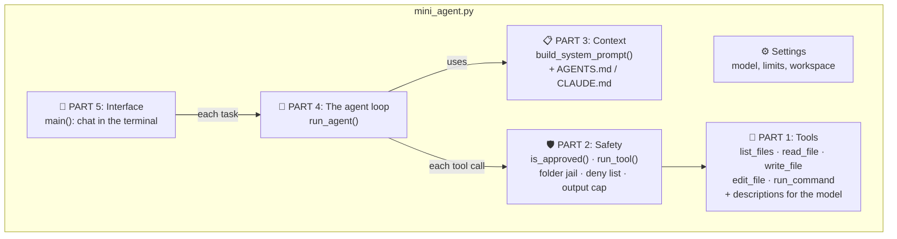
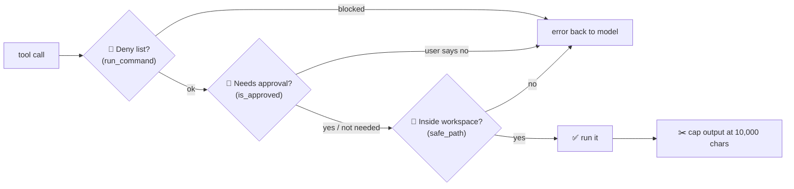

# Chapter 12: Build Your Own Mini Harness

[← Chapter 11](../part-2-harness/11-real-harnesses.md) · [Contents](../README.md) · Next: [Exercises →](../appendix/exercises-and-next-steps.md)

Time to build. In this chapter we walk through [`code/mini_agent.py`](code/mini_agent.py), a small but **real** coding agent. It can explore a folder, write and edit files, run commands, check its own work, and ask your permission before changing anything.

It contains every core idea from Part 2. When you understand this file, you understand how every agent harness works.

---

## 12.1 The map



| Part | Chapter it comes from | Lines (approx.) |
|------|----------------------|-----------------|
| Tools | [Ch. 6](../part-2-harness/06-tools.md) | 42–157 |
| Safety | [Ch. 9](../part-2-harness/09-safety-permissions-sandboxes.md) | 158–184 |
| Context | [Ch. 8](../part-2-harness/08-context-engineering.md) | 185–221 |
| Agent loop | [Ch. 7](../part-2-harness/07-the-agent-loop.md) | 222–282 |
| Interface | [Ch. 11](../part-2-harness/11-real-harnesses.md) | 283–end |

---

## 12.2 Setup

You need Python 3.10 or newer and an Anthropic API key (from the Anthropic Console).

```bash
cd part-3-build/code
pip install -r requirements.txt
export ANTHROPIC_API_KEY="sk-ant-..."      # Windows PowerShell: $env:ANTHROPIC_API_KEY="sk-ant-..."

# Make a practice folder so the agent can't touch anything important
mkdir ~/agent-playground && cd ~/agent-playground
python /path/to/harness-learning/part-3-build/code/mini_agent.py
```

> ⚠️ The agent works in **whatever folder you start it from**. Always start it in a practice folder.

---

## 12.3 Part 1: Tools

Each tool is an ordinary Python function:

```python
def read_file(path: str) -> str:
    return safe_path(path).read_text()
```

Then there's a **description for the model**, the thing it actually sees:

```python
{
    "name": "read_file",
    "description": "Read a text file's full contents. Always read a file before editing it.",
    "input_schema": {
        "type": "object",
        "properties": {"path": {"type": "string", "description": "File path, e.g. 'src/app.py'"}},
        "required": ["path"],
    },
}
```

Notice *"Always read a file before editing it."* That's a **prompt hidden inside a tool description**. It nudges the model toward good habits.

A small dictionary connects the model's tool names to our functions and marks which ones **change things** (and so need permission):

```python
TOOL_FUNCTIONS = {
    "list_files":  (list_files,  False),   # just looking: no approval needed
    "read_file":   (read_file,   False),
    "write_file":  (write_file,  True),    # changes things: ask first
    "edit_file":   (edit_file,   True),
    "run_command": (run_command, True),
}
```

### Why `edit_file` uses "find and replace"

Rewriting a whole 500-line file to change one line is slow, costly, and risky (the model might accidentally change something else). So `edit_file` takes an **exact snippet** to find and its replacement, and it refuses if the snippet is missing or appears more than once. Real harnesses like Claude Code use this same approach.

---

## 12.4 Part 2: Safety

Three protections from Chapter 9, in miniature:



**1. The folder jail**, `safe_path()`:
```python
full = (WORKSPACE / path).resolve()
if full != WORKSPACE and WORKSPACE not in full.parents:
    raise ValueError(f"'{path}' is outside the project folder; access denied.")
```
`resolve()` turns tricks like `../../etc/passwd` into a real absolute path, and then we check that it's still inside the workspace.

**2. Ask before acting**, `is_approved()`: prints what the agent wants to do and waits for `y`.

**3. Never crash the loop**, `run_tool()`: every failure becomes a message the model can read and react to:
```python
try:
    output = TOOL_FUNCTIONS[name][0](**tool_input)
except Exception as error:
    return f"Error: {type(error).__name__}: {error}", True    # True = is_error
```

> ⚠️ **Honest limitation:** a deny list of text patterns is easy to get around (for example `r''m -rf`). It's a teaching example. Real safety needs a real **sandbox** (a container or VM). That's why `--auto` mode should only ever be used inside one.

---

## 12.5 Part 3: Context

```python
def build_system_prompt() -> str:
    prompt = f"""You are a careful coding agent working in the folder {WORKSPACE}.
    ...
    - After changing code, run it or run the tests to check that it works.
    ..."""
    for name in ("AGENTS.md", "CLAUDE.md"):
        memory_file = WORKSPACE / name
        if memory_file.exists():
            prompt += f"\n\n# Project notes from {name}\n{memory_file.read_text()}"
    return prompt

SYSTEM_PROMPT = build_system_prompt()    # built ONCE and kept frozen
```

- The system prompt tells the model **how to work**: explore first, make small changes, verify.
- It loads **project memory files**, so you can drop an `AGENTS.md` in your folder with rules like "use 4-space indents" and the agent will follow them.
- It's built **once** and never changes during the session, which keeps **prompt caching** working (Chapter 8.5).

---

## 12.6 Part 4: The agent loop

This is the heart. Compare it with the diagram in Chapter 7. It's the same thing.

```python
def run_agent(messages: list) -> None:
    for step in range(1, MAX_STEPS + 1):                       # guard rail: step limit
        response = client.beta.messages.create(                 # THINK
            model=MODEL, max_tokens=16000,
            system=SYSTEM_PROMPT, tools=TOOLS, messages=messages,
            output_config={"effort": "high"},
            cache_control={"type": "ephemeral"},
            betas=["server-side-fallback-2026-07-01"],
            fallbacks="default",
        )
        messages.append({"role": "assistant", "content": response.content})   # remember

        if response.stop_reason != "tool_use":                  # done?
            return

        results = []
        for block in response.content:                          # ACT
            if block.type == "tool_use":
                output, is_error = run_tool(block.name, block.input)
                results.append({"type": "tool_result", "tool_use_id": block.id,
                                "content": output, "is_error": is_error})

        messages.append({"role": "user", "content": results})   # OBSERVE, then loop
```

What each API setting means:

| Setting | Meaning | Chapter |
|---------|---------|---------|
| `system=SYSTEM_PROMPT` | The frozen instructions + project memory | 3, 8 |
| `tools=TOOLS` | The menu of tools the model may request | 6 |
| `messages=messages` | The **whole** history; the model has no memory of its own | 2, 7 |
| `max_tokens=16000` | Cap on how much the model can write in one reply | 3 |
| `output_config={"effort": "high"}` | How hard the model thinks. `"low"`/`"medium"` are cheaper and faster | 2 |
| `cache_control={"type": "ephemeral"}` | Turns on **prompt caching**, so the repeated history costs much less | 4, 8 |
| `fallbacks="default"` (+ beta flag) | If the model declines a request, the API retries it on a recommended backup model | 3 |

The real file also handles the special stop reasons (`refusal`, `max_tokens`) and prints token usage every step, so you can **watch the cache work**: from step 2 onward, most input tokens should show as `cached`.

---

## 12.7 Part 5: Interface

`main()` is the **outer loop** from Chapter 7.6: you type a task, the inner agent loop runs until it's done, then you type the next task. The `messages` list lives across tasks, so the agent **remembers the whole session**.

Pressing **Ctrl+C** interrupts the agent. The harness then answers any unfinished tool requests with "Interrupted by the user", because the API requires every `tool_use` to get a `tool_result`.

---

## 12.8 A sample session

```text
$ python mini_agent.py
Mini agent working in /home/you/agent-playground
Mode: ask before changes
Type a task, or 'quit' to exit.

🧑 You: create a python script that prints the first 10 fibonacci numbers, then run it

🔧 list_files({})
   ✅ (empty folder)
   [step 1 · tokens in: 1422 new + 0 cached · out: 64]

🤖 The folder is empty. I'll create fib.py.

🔧 write_file({"path": "fib.py", "content": "a, b = 0, 1\nfor _ in range(10):\n    print(a)\n    a, b = b, a + b\n"})

  🙋 The agent wants to run write_file with:
    {"path": "fib.py", "content": "a, b = 0, 1\n..."}
  Allow? [y/N] y
   ✅ Wrote 62 characters to fib.py
   [step 2 · tokens in: 118 new + 1422 cached · out: 97]

🔧 run_command({"command": "python fib.py"})

  🙋 The agent wants to run run_command with:
    {"command": "python fib.py"}
  Allow? [y/N] y
   ✅ exit code: 0 --- stdout --- 0 1 1 2 3 5 8 13 21 34
   [step 3 · tokens in: 95 new + 1540 cached · out: 41]

🤖 Done! I created fib.py, which prints the first 10 Fibonacci numbers
   (0 to 34), and ran it to confirm the output is correct.
   [step 4 · tokens in: 88 new + 1635 cached · out: 38]
```

*(Exact wording and token numbers will differ on your machine.)*

Look at what happened:
1. The model **explored** first (list_files), because the system prompt told it to.
2. It **wrote** the file, and the harness **asked permission**.
3. It **verified** its work by running it.
4. It **decided it was done** and replied without a tool call, which ended the loop.
5. The **cached** token count grew each step: prompt caching at work.

---

## 12.9 How this compares to a production harness

| Feature | mini_agent.py | Production harness (e.g. Claude Code) |
|---------|---------------|---------------------------------------|
| Agent loop | ✅ | ✅ plus streaming, retries, parallel tool execution |
| File tools | ✅ 4 basic tools | ✅ plus glob/grep search, notebooks, images, diffs |
| Shell | ✅ with timeout | ✅ plus background processes, persistent shell |
| Permissions | ✅ yes/no prompt | ✅ allow/ask/deny rules, modes, remembered choices |
| Sandbox | ❌ folder jail only | ✅ OS-level / container sandboxing |
| Memory files | ✅ AGENTS.md / CLAUDE.md | ✅ nested, per-folder, user-level + auto memory |
| Compaction | ❌ | ✅ automatic summarisation near the limit |
| Prompt caching | ✅ | ✅ |
| Subagents, MCP, skills, hooks | ❌ | ✅ |
| UI | plain terminal | rich terminal, IDE, desktop, web |

The missing rows are exactly the exercises in the [next chapter](../appendix/exercises-and-next-steps.md).

## ✅ Chapter summary

- A working coding agent = **tools + safety checks + a system prompt + the loop + a chat interface**, in about 300 lines.
- Every design choice maps back to a chapter: find-and-replace edits (6), append-only history and caching (8), approvals and the folder jail (9), step limits (7).
- The difference between this and a production harness is **more tools, more safety, and more context management**, not a different core idea.

[← Chapter 11](../part-2-harness/11-real-harnesses.md) · [Contents](../README.md) · Next: [Exercises →](../appendix/exercises-and-next-steps.md)
